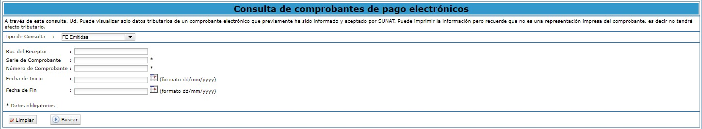

# Visualización de Comprobantes para Clientes

Para poder observar sus comprobantes recibidos.

## Boletas

Ingresa al portal de SUNAT con su clave SOL se dirige a la sección **Empresas**, en la subcategoría **Comprobantes de pago, SEE - SOL, Boleta de Venta Electrónica** y selecciona **Consultar Boleta de venta y Notas**.

Completa los siguientes campos:

:::danger IMPORTANTE:

Debe seleccionar el tipo de Consulta **BVE Recibidas**.
:::

Seguido selecciona **Aceptar**, y podrá visualizar una lista de las boletas.

## FACTURAS

Ingresa al portal de SUNAT, seguido a la sección **Empresas**, **Comprobantes de pago, Factura electrónica, Consultar Factura, Boletas y notas**.

Seguido completa los siguientes datos:

:::danger IMPORTANTE:

Selecciona el Tipo de consulta FE Recibidas.
:::
Selecciona **Aceptar** y podrá visualizar la boleta.
