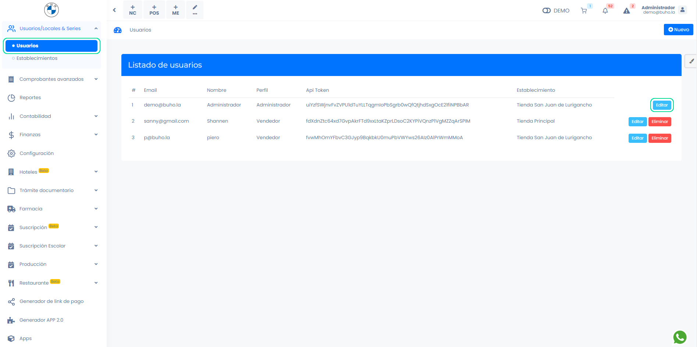
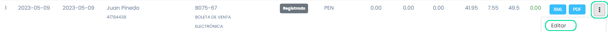

# Editar mis comprobantes

En este artículo te enseñaremos a editar tu comprobante. Sigue estos pasos para realizarlo:

## Habilitar permiso

Para habilitar la opción debe ingresar al módulo **Configuración**, en la subcategoría **Empresa**, selecciona **Avanzado** y seguido se dirige a **Visual**.

## Activar permiso

Para activar la opción debe ingresar al módulo **Usuarios/ Locales & Series**, en la subcategoría **Usuarios**.

Seleccionar la siguiente casilla y selecciona el botón **Guardar**:

## Para editar los comprobantes

Ingresa al módulo de **Ventas**, selecciona la subcategoría **Lista de comprobantes**. Seguido selecciona los tres puntos del lado derecho, selecciona la opción **Editar**.

Seguido podrá editar el comprobante electrónico.

:::info IMPORTANTE:
Para editar comprobantes deben hacerlo con el usuario que tenga asignado a esa serie.
:::
