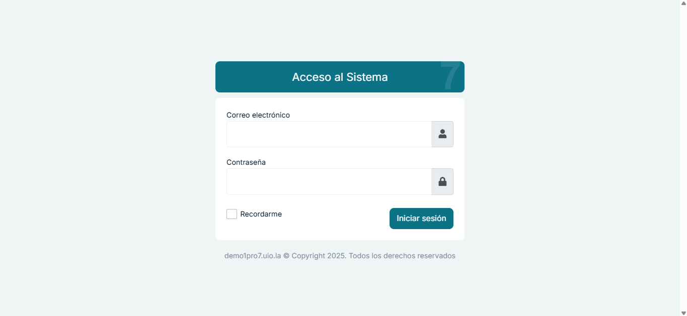
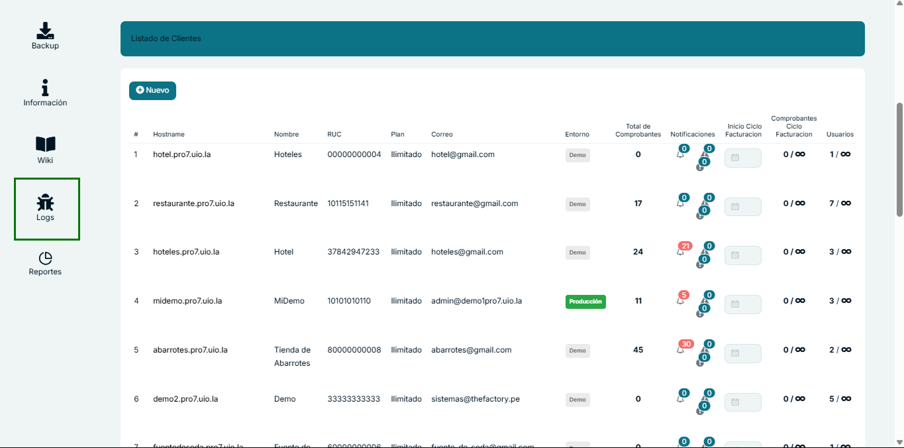

# Acceso y Visualización de Logs del Sistema

## Índice
1. [Acceso al Sistema](#acceso-al-sistema)
2. [Navegación al Panel de Logs](#navegación-al-panel-de-logs)
3. [Visualización de Logs](#visualización-de-logs)
4. [Interpretación de Errores](#interpretación-de-errores)
5. [Utilidad para Soporte Técnico](#utilidad-para-soporte-técnico)

## Acceso al Sistema

1. Ingrese a la URL del sistema de facturación.
2. En la pantalla de inicio de sesión, introduzca sus credenciales:
   - Correo electrónico
   - Contraseña
3. Haga clic en el botón "Iniciar sesión"

## Navegación al Panel de Logs

1. Una vez dentro del Dashboard, desplácese hasta la parte inferior izquierda del panel lateral.
2. Ubique y haga clic en la opción "Logs" representada por un ícono de insecto (bug).

## Visualización de Logs

Al acceder a la sección de Logs, se mostrará el "Laravel Log Viewer" que presenta:

1. Una lista de archivos de logs organizados por fecha en el panel izquierdo
2. Panel principal que muestra los registros de errores con la siguiente información:
   - Nivel de error (error, warning, info)
   - Contexto 
   - Fecha y hora
   - Contenido detallado del error

## Interpretación de Errores

Los logs muestran información técnica detallada que es fundamental para la resolución de problemas:

- **Level**: Indica la gravedad del evento (error, warning, info, etc.)
- **Context**: Muestra el entorno donde ocurrió el error
- **Date**: Fecha y hora exacta del evento
- **Content**: Descripción detallada del error, incluyendo:
  - Número de línea en el código
  - Mensaje de error específico
  - Detalles técnicos como consultas SQL, valores de variables, etc.

## Utilidad para Soporte Técnico

Esta sección de Logs es especialmente útil cuando necesite comunicarse con el equipo de soporte técnico por las siguientes razones:

1. **Diagnóstico preciso**: Permite identificar con exactitud el origen y naturaleza de los problemas.
2. **Comunicación eficiente**: Al compartir los detalles específicos del log con el equipo de soporte, se agiliza la resolución del problema.
3. **Seguimiento cronológico**: Facilita el rastreo de la secuencia de eventos que condujeron al error.

### Recomendaciones al contactar a Soporte

Cuando reporte un problema al equipo de soporte:

1. Indique la fecha y hora exacta del error según aparece en los logs
2. Comparta el mensaje de error completo, preferiblemente mediante una captura de pantalla
3. Mencione las acciones que estaba realizando cuando ocurrió el error
4. Si es posible, exporte el archivo de log específico para enviarlo al equipo de soporte

---

