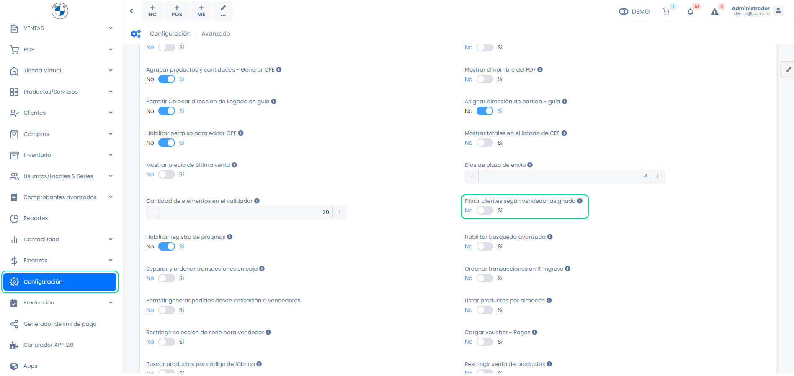

# ¿Por qué los vendedores no pueden ver la lista de clientes?

En este artículo te enseñaremos a resolver el inconveniente acerca de que los vendedores no pueden acceder a la lista de clientes. Sigue estos pasos para realizarlo:

Ingresa al módulo de **Configuración**, y luego en la categoría **Empresa**, selecciona **Avanzado.**

Seguido, la siguiente opción debe estar desactivada:

Si la opción se encuentra activada, el vendedor solo podrá ver a sus clientes asignados.
