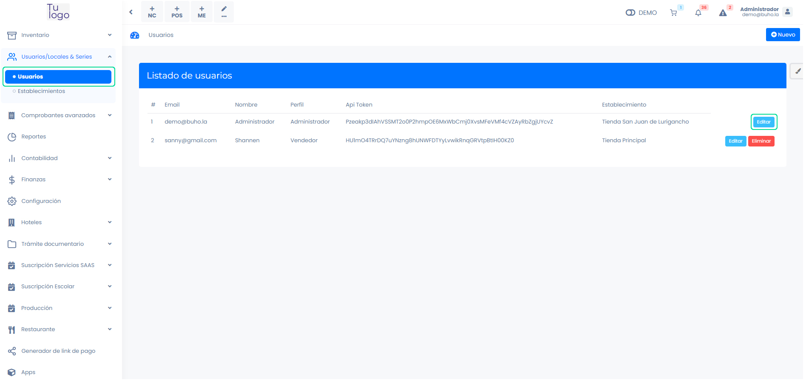
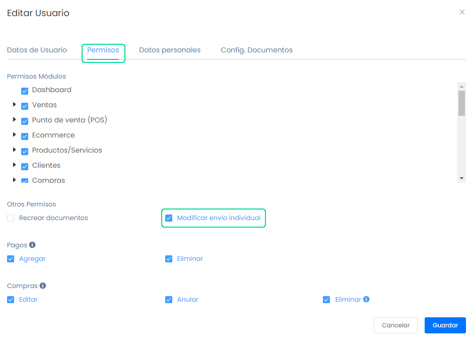
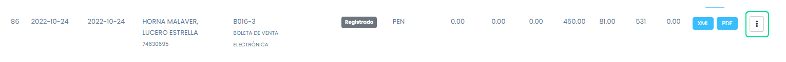

# Pasos a realizar si mis boletas no se enviaron

En este artículo te enseñaremos a enviar tus boletas pendientes de envío con fechas de retraso. Sigue estos pasos para realizarlo:

Ingresa al módulo de **Usuarios/Locales & Series**, luego en la categoría Usuarios. Selecciona en el botón editar del perfil Administrador.

Seguido aparecerá una ventana emergente, donde debe activar la siguiente casilla de selección:

- **Modificar envío individual:** Se habilita el permiso para modificar el tipo de envío de las boletas - envío individual a resumen de boletas.

:::danger IMPORTANTE:
- Solo aplica si la boleta fue enviada de forma individual y se encuentra en estado registrado.
:::

Seguido, en el módulo **Ventas**, la subcategoría **Listado de Comprobantes**. Selecciona los tres puntos laterales, y seguido selecciona la opción: **Enviar por resumen**.

Seguido aparecerá la siguiente ventana emergente:

Selecciona el botón **Modificar**.

El siguiente paso es crear un Resumen. Ingresa al Módulo **Ventas**, en la subcategoría **Resúmenes y Anulaciones** selecciona **Resúmenes**. Y para crear un resumen selecciona el botón **Nuevo**.

Seguido aparecerá la siguiente ventana emergente. Para registras resumen deberá seleccionar la fecha de emisión de comprobantes, después selecciona el botón **Buscar comprobantes**.

Una vez que visualice el comprobante que desea enviar, selecciona **Guardar**. El estado del comprobante se cambiara a Enviado, para que el estado este en **Aceptado**, selecciona el botón **Consultar**.

Y el estado cambiara a **ACEPTADO**.
