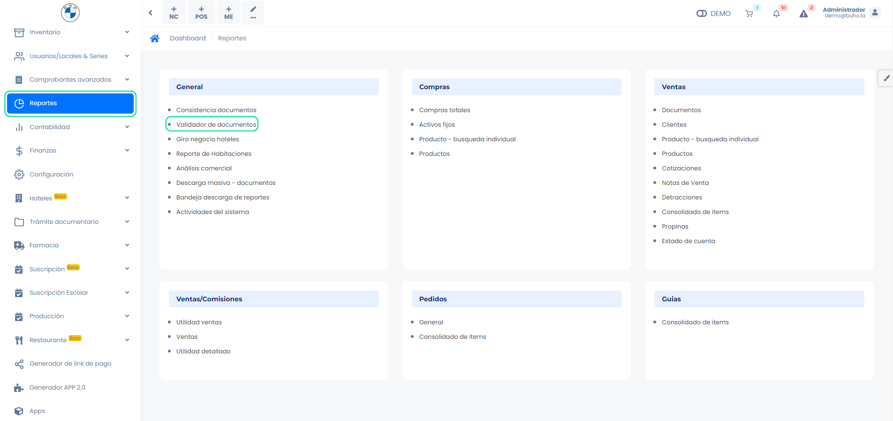
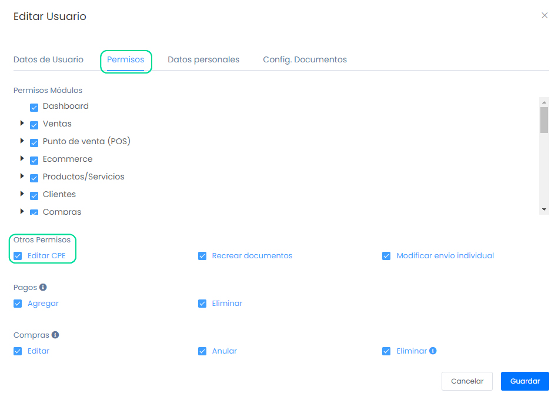
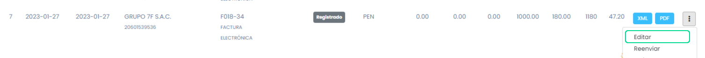

# Pasos a realizar si mis facturas no se enviaron a tiempo

En este artículo te enseñaremos a que realizar si cuenta con alguna factura que no se envío a tiempo. Sigue estos pasos para realizarlo:

## 1. Verificar el estado de la factura

Puede verificarlo en el **Validador de documentos** desde el sistema o desde el portal de SUNAT. Para ingresar al validador de documentos, ingresa al módulo **Reportes**, en la subcategoría **General** y selecciona el **Validador de documentos**.

Si el estado es NO EXISTE, para no perder el número correlativo de la factura, siga el siguiente paso.

## 2. Habilitar permiso para editar CPE

Para habilitar el permiso, ingresa al módulo Configuración y luego en la subcategoría Empresa, selecciona Avanzado.

Seguido, en la sección Visual tendrá que activar la siguiente opción:

Seguido, nos dirigimos al módulo **Usuarios/Locales & Series**, en la subcategoría **Usuarios**, seguido seleccione el botón **Editar**.

Nos dirigimos a la sección Permiso, activamos la casilla de selección: **Editar permisos CPE**.

:::danger IMPORTANTE:

- Esta configuración sirve para boleta y factura, que tengan el estado **REGISTRADO**, no aplica para comprobantes con estado rechazados, anulados o aceptado.
-Verificar si el estado del comprobantes sea RECHAZADO o ANULADO se encuentra en SUNAT, si no se subió el estado, puede seleccionar editar para poder registrarlo y seguido podrá enviar el comprobante.
:::

## 3. Recrear comprobante electrónico

Para recrear un documento, ingresa al módulo **Ventas**, seguido en la subcategoría **Lista de comprobantes**.

Selecciona los tres puntos que se encuentra la derecha del comprobante electrónico y selecciona **Editar**.

Seguido podrá recrear el documento, tendrá que cambiar la fecha que se ajusten a las normas de **SUNAT**.
