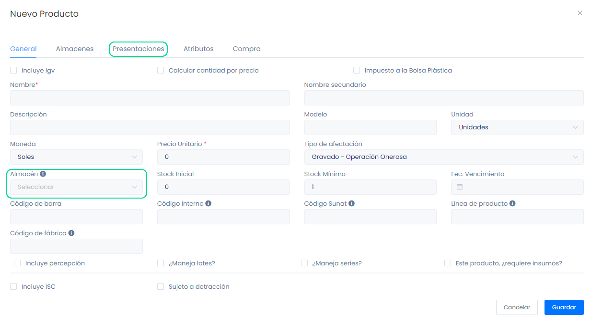

# Manejo de Precios por Presentación y Almacén

En este artículo te enseñaremos a manejar diferentes precios de un producto con diferentes presentaciones. Sigue estos pasos para realizarlo:

Para crear un producto con diferentes presentaciones, se debe crear el producto y seleccionar diferentes almacenes, para ello deberá ingresar al módulo **Productos** y selecciona la subcategoría **Productos**, selecciona el botón selecciona **Nuevo**.

Crea el producto y selecciona el **Almacén** en que irá el producto. Seguido se pasa a secciones y puede editar la lista de precios.

