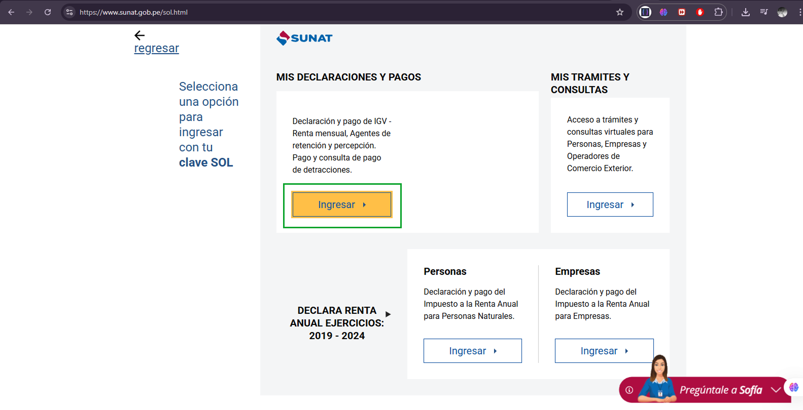

# Manual de alta en SUNAT - PSE

**PROVEEDOR DE SERVICIOS ELECTRÓNICOS**

---

## Instrucciones

### 1. Acceder a SUNAT
Ir a la SUNAT: [www.sunat.gob.pe](https://www.sunat.gob.pe/)

### 2. Buscar Operaciones en Línea
Buscar la opción: **Operaciones en línea (SOL)**

### 3. Ingresar a Mis Trámites
Clic en la opción **Ingresar en mis trámites y consultas**

### 4. Ingresar Clave SOL
Se abrirá una nueva pestaña donde ingresará su **clave SOL**

### 5. Buscar Comunicación Tercerización
Busque la opción: **Comunicación Tercerización con PSE** y dele clic en **Altas / Bajas de PSE**

### 6. Registrar Alta de Servicio
Clic en **Alta Servicio**

### 7. Completar el Registro
A continuación hacer lo siguiente:

- Ingresa nuestro RUC: **20603684291** y haz clic en el cuadrado pequeño **+**
- Ingresa una fecha de inicio (usar la fecha del día siguiente en adelante) y clic en **Guardar**

---

**Eso es todo**, envíamos una captura de pantalla según las instrucciones que hayas recibido.

---

