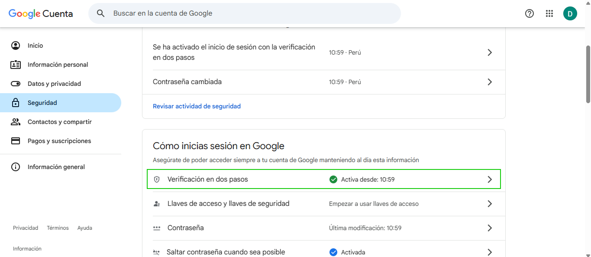
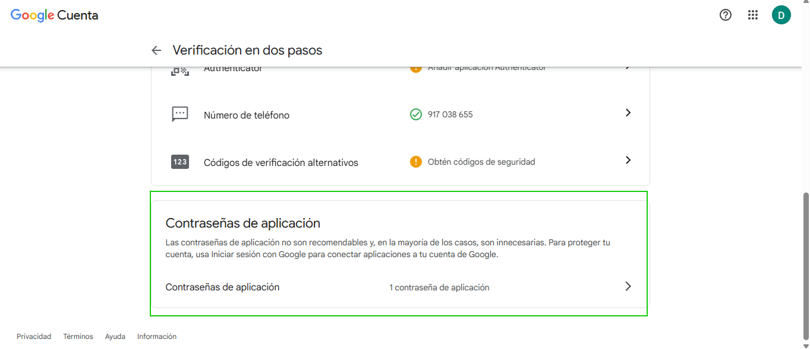

# Configuración Segura de SMTP para Envío de Correos

Configura correctamente el servidor SMTP para garantizar el envío seguro de correos electrónicos desde tu aplicación. Esta guía te ayudará a implementar las mejores prácticas de seguridad en la configuración del servidor de correo.

## 1. Configuración del Protocolo de Seguridad

### Cambio de SSL a TLS

Para una mayor seguridad en el envío de correos, es fundamental utilizar **TLS (Transport Layer Security)** en lugar de SSL:

**¿Por qué TLS es más seguro que SSL?**

- **TLS 1.2 y 1.3** son las versiones más recientes y seguras del protocolo
- **SSL 3.0** y versiones anteriores tienen vulnerabilidades conocidas y están deprecadas
- **TLS** ofrece mejor cifrado y autenticación más robusta
- **Compatibilidad mejorada** con servidores modernos de correo
- **Mayor resistencia** a ataques de interceptación y manipulación de datos

```yaml
# Configuración recomendada
security: tls
encryption: tls
```

:::tip SEGURIDAD
TLS 1.2 y TLS 1.3 son los estándares actuales de la industria para comunicaciones seguras. SSL 3.0 y versiones anteriores han sido oficialmente deprecadas debido a vulnerabilidades críticas de seguridad.
:::

## 2. Configuración del Puerto SMTP

### Cambio al Puerto 587

El **puerto 587** es el estándar recomendado para el envío de correos SMTP con autenticación:

**¿Por qué el puerto 587 es más seguro?**

- **Puerto estándar IANA** para envío de correo con autenticación (RFC 6409)
- **Requiere autenticación obligatoria** antes del envío
- **Soporte nativo para STARTTLS** que garantiza cifrado de extremo a extremo
- **Menor probabilidad de bloqueo** por parte de ISPs y firewalls corporativos
- **Mejor compatibilidad** con servicios de correo modernos como Gmail, Outlook, etc.

Comparación de puertos SMTP:

| Puerto | Uso | Seguridad | Recomendación |
|--------|-----|-----------|---------------|
| 25 | SMTP básico | Sin cifrado | ❌ No recomendado |
| 465 | SMTP sobre SSL | SSL implícito | ⚠️ Deprecado |
| 587 | SMTP con STARTTLS | TLS explícito | ✅ **Recomendado** |

```yaml
# Configuración recomendada
port: 587
```

## 3. Configuración de Autenticación

### Contraseñas de Aplicación

Para servicios como Gmail, es necesario generar contraseñas específicas de aplicación:

:::danger IMPORTANTE - CONTRASEÑAS
- Las contraseñas **NO deben contener espacios en blanco**
- Utiliza contraseñas de aplicación específicas, no tu contraseña personal
- Genera una nueva contraseña para cada aplicación o servicio
:::

**Generar contraseña de aplicación para Gmail:**

1. Accede a la configuración de tu cuenta de Google
   

2. Ve a la sección de seguridad
   

3. Habilita la verificación en dos pasos (requisito obligatorio)
   

4. Navega a la sección "Contraseñas de aplicación" ubicada en la parte inferior de la configuración de verificación en dos pasos
   

5. Tendra que asignar un nombre descriptivo a la contraseña en este caso es **Facturalo**
   

6. Google generará una contraseña de 16 caracteres. Cópiala inmediatamente ya que solo se mostrará una vez
   

📧 **Enlace oficial:** [Cómo generar contraseñas de aplicación en Gmail](https://support.google.com/mail/answer/185833?hl=es-419#)

## 4. Ejemplo de Configuración Completa

```yaml
smtp:
  host: smtp.gmail.com
  port: 587
  security: tls
  auth:
    username: tu-email@gmail.com
    password: tu-contraseña-de-aplicacion-sin-espacios
  encryption: tls
```

## 5. Verificación de la Configuración

### Pruebas de Conectividad

Después de implementar la configuración, verifica que:

- ✅ La conexión se establece correctamente en el puerto 587
- ✅ El protocolo TLS se negocia exitosamente
- ✅ La autenticación se realiza sin errores
- ✅ Los correos se envían y entregan correctamente

### Logs de Depuración

Revisa los logs del sistema para confirmar:

```log
[INFO] SMTP connection established on port 587
[INFO] STARTTLS negotiation successful
[INFO] Authentication successful
[INFO] Mail sent successfully
```

## 6. Beneficios de la Configuración Segura

### Ventajas del TLS sobre SSL:

- **Cifrado más fuerte**: Algoritmos de cifrado más robustos
- **Autenticación mejorada**: Verificación más estricta de identidades
- **Integridad de datos**: Mejor protección contra manipulación
- **Compatibilidad futura**: Soporte continuo y actualizaciones de seguridad

### Ventajas del Puerto 587:

- **Estándar de la industria**: Ampliamente soportado y recomendado
- **Autenticación obligatoria**: Previene el uso no autorizado
- **Mejor entregabilidad**: Menor probabilidad de ser marcado como spam
- **Cumplimiento normativo**: Alineado con las mejores prácticas de seguridad

:::warning ADVERTENCIA
Nunca utilices configuraciones inseguras como SSL 3.0 o puertos sin autenticación en entornos de producción. Estas configuraciones exponen tu sistema a vulnerabilidades de seguridad críticas.
:::

## 7. Solución de Problemas Comunes

### Error de Conexión Rechazada
- Verifica que el puerto 587 esté abierto en el firewall
- Confirma que el proveedor de hosting permite conexiones SMTP salientes

### Error de Autenticación
- Asegúrate de que la contraseña no contenga espacios
- Verifica que la verificación en dos pasos esté habilitada
- Regenera la contraseña de aplicación si es necesario

### Error de Certificado TLS
- Confirma que el servidor soporte TLS 1.2 o superior
- Verifica que los certificados del servidor estén actualizados

---

:::tip RECOMENDACIÓN FINAL
Mantén siempre actualizadas las configuraciones de seguridad y revisa regularmente las mejores prácticas para el envío de correos electrónicos. La seguridad en las comunicaciones es fundamental para proteger tanto tu aplicación como los datos de tus usuarios.
:::