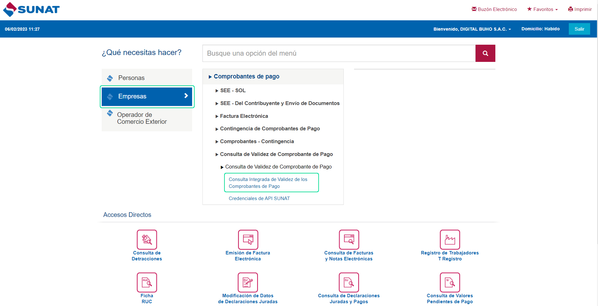
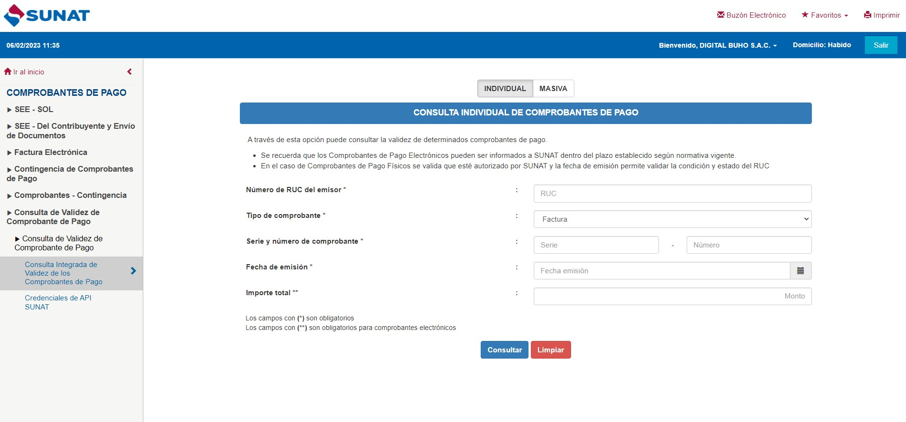

# ¿Donde puedo ver mis comprobantes emitidos?

Para poder observar sus comprobantes emitidos, ingresamos al portal de SUNAT.

Nos dirigimos a la sección **Empresas** y seleccionamos **Consulta integrada de Validez de los comprobantes de Pago**.

Completa los siguientes campos:

:::info IMPORTANTE:

Se puede consultar los siguientes documentos:
- Factura
- Boleta de venta
- Nota de crédito
- Nota de débito
- Recibo por honorarios
- Nota de crédito recibo por honorarios
- Liquidación de compra
- Póliza de adjudicación electrónica
:::
Seguido selecciona el botón **Consultar.** Y aparecerá el estado del comprobante.

Existe de otra manera, seleccionando la siguiente opción:

Deberá completar los datos necesarios:

:::info IMPORTANTE:
Se puede consultar los siguientes documentos:
- Facturas emitidas
- Facturas Recibidas
- Notas de crédito recibidas
- Notas de crédito emitidas
- Notas de débito recibidas
- Notas de débito emitidas
- Boletas Emitidas - OSE
- Notas de crédito -Boletas Emitidas - OSE
- Notas de débito - Boletas Emitidas - OSE
:::
