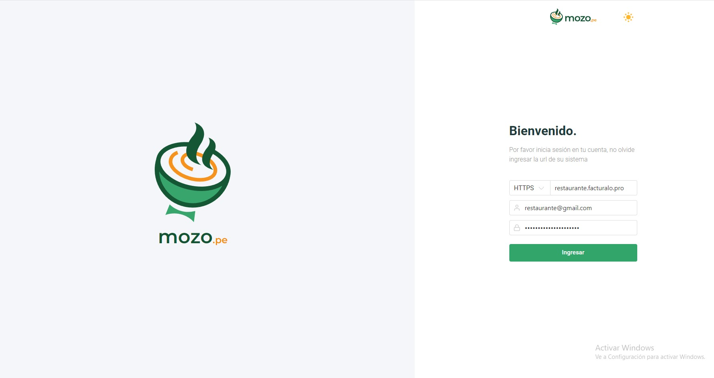

import DocsCard from '/src/components/global/DocsCard';
import DocsCards from '/src/components/global/DocsCards';

# Iniciar Sesión en Mozo

<head>
  <title>Iniciar Sesión en Mozo - Sistema de Gestión para Restaurantes</title>
  <meta
    name="description"
    content="Aprende cómo iniciar sesión en Mozo.pe (versión web) y Mozo Compilado (versión instalable) para gestionar tu restaurante."
  />
</head>

## Introducción

El **Sistema para Mozo** es una solución integral diseñada para agilizar y optimizar las operaciones de restaurantes, bares y cafeterías. Este sistema facilita el trabajo del personal de servicio, permitiéndoles gestionar de manera eficiente mesas, pedidos y comandas, a la vez que interactúan directamente con un módulo de Punto de Venta (POS) para la facturación y cobro.

Con este sistema, los mozos pueden asignar y controlar el estado de las mesas, tomar pedidos rápidamente y enviar las comandas de manera automática a la cocina o barra. Todo ello está integrado dentro de un flujo de trabajo que mejora la experiencia del cliente, reduce errores en los pedidos y optimiza el tiempo de servicio.

---

## 🔐 Tipos de Inicio de Sesión

Dependiendo de la versión del sistema Mozo que estés utilizando, el proceso de inicio de sesión varía:

<DocsCards>
  <DocsCard 
    header="Mozo.pe (Versión Web)"
    href="#mozope-versión-web"
  >
    <p>Requiere configuración de URL y credenciales de acceso. Ideal para pruebas y uso rápido.</p>
  </DocsCard>

  <DocsCard
    header="Mozo Compilado"
    href="#mozo-compilado-versión-instalable"
  >
    <p>Inicio de sesión directo sin URL, con opciones de usuario y PIN. Instalado en tu servidor.</p>
  </DocsCard>
</DocsCards>

---

## 🌐 Mozo.pe (Versión Web)

### Características del Inicio de Sesión Web

La versión web de Mozo.pe requiere tres elementos para iniciar sesión:

1. **URL del Sistema**: Dirección del servidor donde está alojado tu sistema Pro 8
2. **Correo Electrónico**: Usuario registrado en el sistema
3. **Contraseña**: Contraseña asociada al correo

### 🎯 Demo del Sistema

Para probar la demo del sistema, puedes acceder a través del siguiente enlace:

**[Sistema para Mozo - Demo](https://mozo.pe/app)**



### 📝 Credenciales de Acceso Demo

Utiliza las siguientes credenciales para acceder a la demo:

```
URL: https://cevicheria.pro7.uio.la/login
Correo: cevicheria@gmail.com
Contraseña: 123456
```

:::tip Consejo
Guarda la URL de tu sistema en un lugar seguro. La necesitarás cada vez que inicies sesión desde la versión web.
:::

### Pasos para Iniciar Sesión

1. **Accede a Mozo.pe**: Ve a [https://mozo.pe/app](https://mozo.pe/app)
2. **Ingresa la URL**: Escribe la URL completa de tu sistema Pro 8
3. **Completa tus credenciales**: 
   - Correo electrónico
   - Contraseña
4. **Haz clic en "Ingresar"**

:::info Nota Importante
La URL debe incluir el protocolo completo (https://) y la ruta completa hasta /login si es requerida.
:::

---

## 💻 Mozo Compilado (Versión Instalable)

### Diferencias con la Versión Web

A diferencia de la versión web en Mozo.pe, el inicio de sesión de la **versión compilada** NO requiere configurar la URL manualmente. Esto se debe a que el sistema Mozo se instaló directamente en el servidor de tu cliente.

Durante el [paso final de la instalación en cPanel](https://manual.uio.la/Pro7/Mozo.pe/Instalacion-Mozo-cPanel#paso-5-configuración-del-sistema), la URL de la API ya fue configurada automáticamente, por lo que solo necesitas las credenciales de acceso.

### 🔑 Métodos de Acceso

La versión compilada ofrece **dos formas diferentes** de iniciar sesión:

<DocsCards>
  <DocsCard 
    header="1. Usuario Administrador o Caja"
    href="#método-1-usuario-administrador-o-caja"
  >
    <p>Acceso completo con correo electrónico y contraseña.</p>
  </DocsCard>

  <DocsCard
    header="2. Usuario Mozo con PIN"
    href="#método-2-usuario-mozo-con-pin"
  >
    <p>Selección de mozo desde una lista y confirmación con código PIN de 4 dígitos.</p>
  </DocsCard>
</DocsCards>

---

### Método 1: Usuario Administrador o Caja

Este método es para usuarios con permisos administrativos o de caja que necesitan acceso completo al sistema.


**Credenciales requeridas:**

1. **Correo Electrónico**: Correo del usuario administrador o caja
2. **Contraseña**: Contraseña asociada al correo

:::warning Importante
Solo usuarios con rol de **Administrador** o **Caja** pueden iniciar sesión mediante este método.
:::

**Pasos:**

1. Abre la aplicación Mozo en tu dispositivo
2. Ingresa tu correo electrónico en el campo correspondiente
3. Escribe tu contraseña
4. Haz clic en **"Ingresar"**

---

### Método 2: Usuario Mozo con PIN

Este método permite que los mozos inicien sesión seleccionando su nombre de una lista predefinida y confirmando su identidad con un código PIN.


**Características:**

- Visualización de todos los mozos disponibles con avatares ilustrativos
- Selección simple mediante un clic en tu perfil
- Verificación de identidad con PIN de 4 dígitos
- Ideal para dispositivos compartidos en el área de servicio
- Mayor seguridad mediante autenticación de dos pasos

**Pasos:**

1. En la pantalla de inicio de sesión, haz clic en **"Accesos mozo"**
2. Aparecerá una lista con ilustraciones de todos los mozos registrados
3. **Selecciona tu nombre** haciendo clic en tu perfil
4. Se abrirá automáticamente un modal solicitando tu **PIN**
5. Ingresa tu código PIN de 4 dígitos
6. Haz clic en **"Ingresar"**
7. El sistema te llevará directamente al panel de mesas

:::tip Ventaja
Este método combina la facilidad de identificación visual con la seguridad de autenticación mediante PIN, siendo ideal para personal que trabaja con tablets o dispositivos compartidos.
:::

:::info Configuración de PIN
El PIN debe ser configurado previamente por el administrador del sistema para cada mozo. Contacta a tu supervisor si no conoces tu PIN.
:::

---

## 🔄 Comparación de Métodos de Acceso

| Método | Versión Web | Versión Compilada | Tipo de Usuario | Ventajas |
|--------|-------------|-------------------|-----------------|----------|
| **URL + Correo + Contraseña** | ✅ Sí | ❌ No | Todos | Acceso desde cualquier lugar |
| **Correo + Contraseña** | ❌ No | ✅ Sí | Admin/Caja | Control total del sistema |
| **Selección Visual + PIN** | ❌ No | ✅ Sí | Mozo | Identificación visual y seguridad con PIN |

---

## 🚀 Próximos Pasos

Una vez que hayas iniciado sesión exitosamente, puedes comenzar a utilizar las funcionalidades principales del sistema:

<DocsCards>
  <DocsCard 
    header="Módulo de Mesas"
    href="mesas"
  >
    <p>Gestiona la asignación y estado de las mesas en tu restaurante.</p>
  </DocsCard>

  <DocsCard
    header="Módulo POS"
    href="pos"
  >
    <p>Procesa pagos y genera comprobantes electrónicos.</p>
  </DocsCard>

  <DocsCard
    header="Configuración"
    href="mozo_config_previa"
  >
    <p>Configura parámetros iniciales antes de usar el sistema.</p>
  </DocsCard>
</DocsCards>

---

## ❓ Preguntas Frecuentes

<details>
<summary>¿Qué hago si olvidé mi contraseña?</summary>

Contacta al administrador del sistema para que restablezca tu contraseña. Los mozos también pueden solicitar un nuevo PIN si lo olvidan.
</details>

<details>
<summary>¿Puedo usar la misma cuenta en múltiples dispositivos?</summary>

Sí, tanto en la versión web como compilada puedes iniciar sesión desde diferentes dispositivos. Sin embargo, ten en cuenta que algunas acciones pueden requerir cerrar sesión en otros dispositivos.
</details>

<details>
<summary>¿Cuál es la diferencia entre un usuario Mozo y un usuario Administrador?</summary>

Los usuarios **Mozo** solo tienen acceso al módulo de mesas y comandas, mientras que los usuarios **Administrador** y **Caja** tienen acceso completo al sistema, incluyendo configuraciones y reportes.
</details>

<details>
<summary>¿La versión web guarda mi URL para futuros accesos?</summary>

Depende de tu navegador y configuración. Algunos navegadores permiten autocompletar campos guardados. Para mayor comodidad, considera usar la versión compilada si accedes frecuentemente.
</details>

---

## 🛠️ Solución de Problemas

### No puedo iniciar sesión en Mozo.pe

**Posibles soluciones:**

1. Verifica que la URL esté escrita correctamente (incluye https://)
2. Asegúrate de que tu sistema Pro 8 esté activo y accesible
3. Confirma que tus credenciales sean correctas
4. Limpia la caché de tu navegador
5. Intenta desde otro navegador o dispositivo

### No aparezco en la lista de mozos

**Posibles soluciones:**

1. Verifica que tu usuario tenga el rol de "Mozo" asignado
2. Contacta al administrador para que revise tu configuración de usuario
3. Asegúrate de que tu usuario esté activo en el sistema

### Mi PIN no funciona

**Posibles soluciones:**

1. Confirma que estés ingresando el PIN correcto (4 dígitos)
2. Solicita al administrador que verifique tu PIN en el sistema
3. Si es necesario, pide que te asignen un nuevo PIN

---


## 🔒 Seguridad y Buenas Prácticas

:::warning Recomendaciones de Seguridad

1. **No compartas tus credenciales** con otros usuarios
2. **Cambia tu contraseña periódicamente** (cada 3-6 meses)
3. **Cierra sesión** al finalizar tu turno, especialmente en dispositivos compartidos
4. **Mantén tu PIN privado** y no lo escribas en lugares visibles
:::
