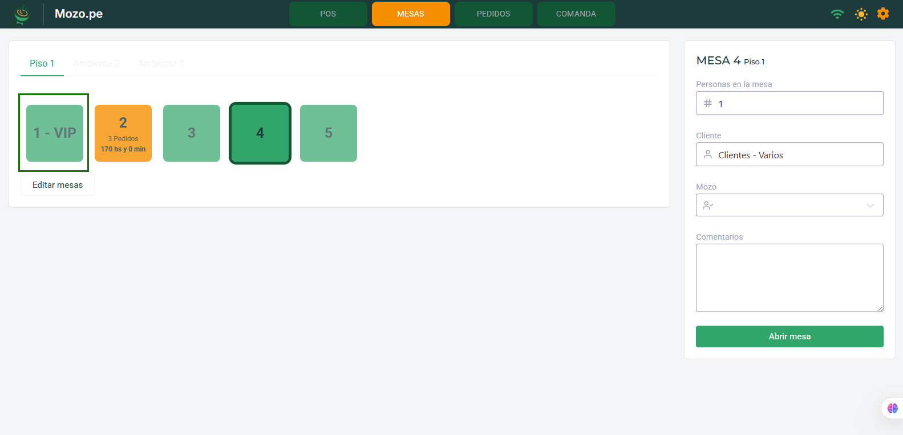
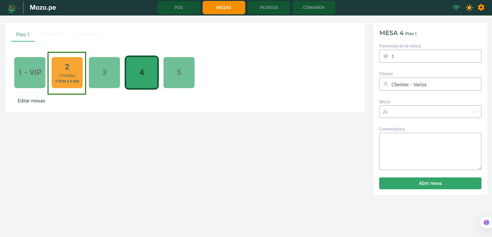
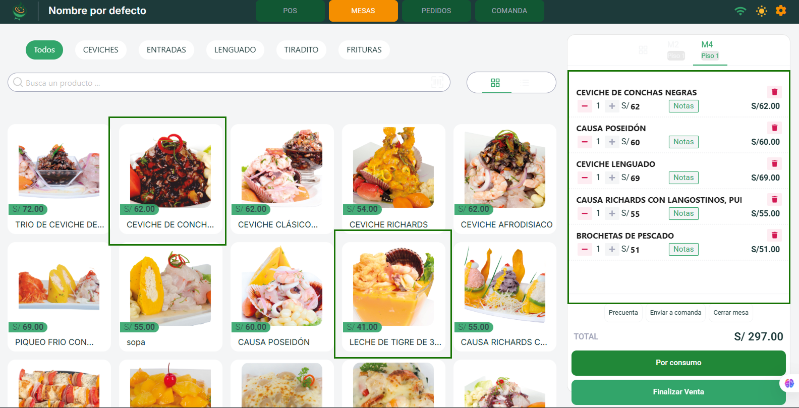
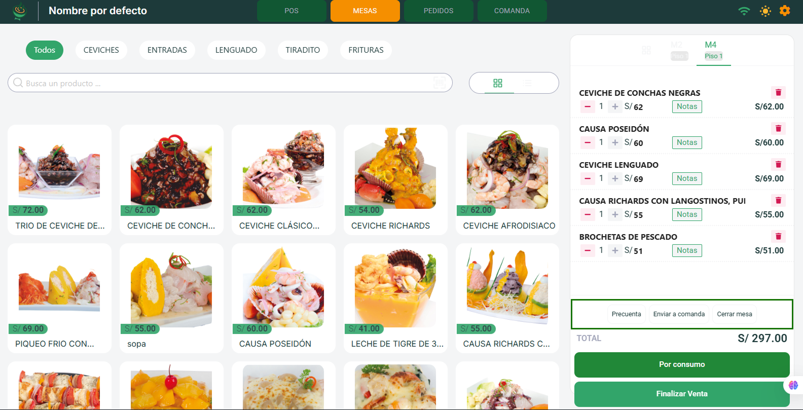
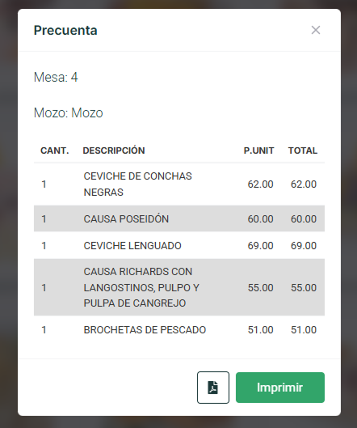
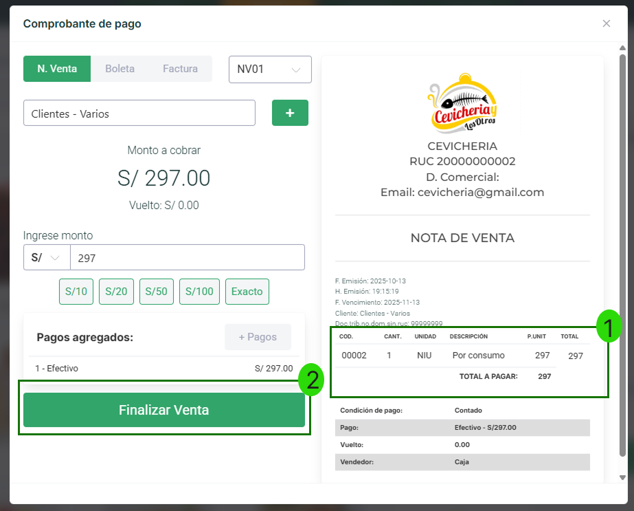
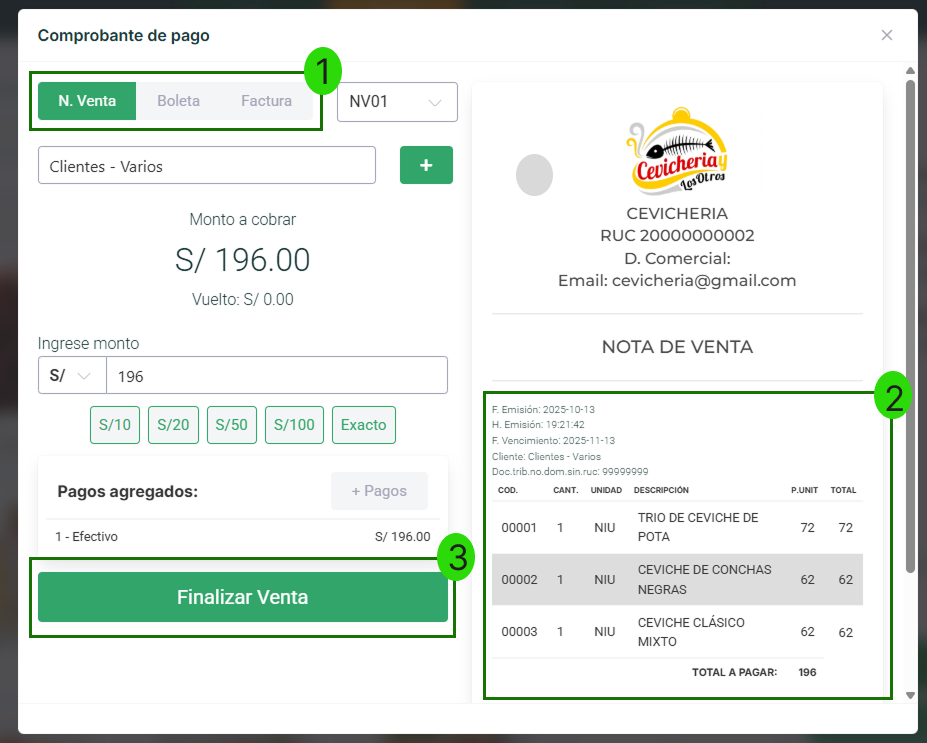
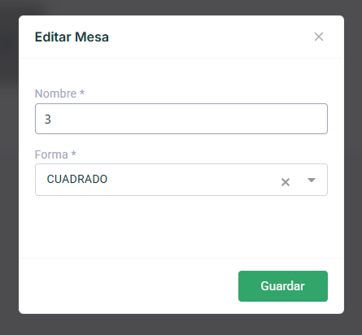

# 📋 Módulo Mesas

El **Módulo Mesa** permite a los mozos gestionar de manera eficiente las mesas del restaurante, asignar pedidos y coordinar con la cocina para la preparación de los platillos. Los mozos pueden seleccionar una mesa, tomar el pedido de los clientes y luego enviarlo a la cocina mediante una **comanda**, que puede imprimirse para facilitar el trabajo del equipo de cocina.

---

## 🎨 Estados de las Mesas

Cada mesa tiene un indicador visual que muestra su estado actual:

### 🟢 Mesa Libre
La mesa está **disponible** para asignar a nuevos clientes.

| Mesa Libre | Vista |
|------------|-------|
| Estado: Disponible |  |

### 🟡 Mesa Ocupada
La mesa está **en uso** con clientes atendidos.

| Mesa Ocupada | Vista |
|--------------|-------|
| Estado: En servicio |  |

::::danger ⚠️ IMPORTANTE - Control de Tiempo
Cada mesa registra el **tiempo desde que fue abierta**, permitiendo que el personal de servicio tenga control sobre la duración del servicio y agilice la rotación de las mesas.

**Ejemplo:** `3 Pedidos - 170 hs y 0 min`
::::

---

## 📝 Proceso de Gestión de Mesa

### Paso 1: Abrir Mesa

Cuando llegan los clientes, el mozo debe configurar la mesa con la siguiente información:

#### Campos del Formulario

| N° | Campo | Descripción |
|----|-------|-------------|
| **1** | **Personas en la mesa** | Cantidad de comensales que ocuparán la mesa |
| **2** | **Cliente** | Nombre del cliente (opcional) - Por defecto: "Clientes - Varios" |
| **3** | **Mozo** | Seleccionar al mozo asignado (configurado previamente en panel administrativo) |
| **4** | **Comentarios** | Notas especiales o requerimientos del cliente |
| **5** | **Abrir mesa** | Botón para confirmar y activar la mesa |

::::tip 💡 Buenas Prácticas
- Verificar el número correcto de personas antes de abrir la mesa
- Agregar comentarios sobre alergias o preferencias especiales
- Asignar el mozo correcto para facilitar el seguimiento del servicio
::::

---

### Paso 2: Tomar el Pedido

Una vez abierta la mesa, el mozo procede a tomar el pedido:

1. **Navegación por categorías**
   - Todos, CEVICHES, ENTRADAS, LENGUADO, TIRADITO, FRITURAS

2. **Búsqueda de productos**
   - Usar el buscador para encontrar platillos específicos rápidamente

3. **Agregar productos**
   - Hacer clic en los platillos deseados para agregarlos al pedido
   - Los productos seleccionados aparecerán en el panel derecho con precio y cantidad

---

### Paso 3: Gestionar el Pedido

Una vez seleccionados los platillos, el mozo tiene tres opciones principales:

#### 🧾 Precuenta

Genera un resumen del pedido antes de procesar el pago:

**Información mostrada:**
- Mesa y mozo asignado
- Listado completo de productos con cantidades y precios
- Total a pagar

**Opciones:**
- 📄 **Descargar PDF** de la precuenta
- 🖨️ **Imprimir** directamente

---

#### 📨 Enviar a Comanda

Envía los platillos seleccionados a la cocina:

**Proceso:**
1. Seleccionar los productos a enviar (pueden ser todos o parciales)
2. Ver estado: **TOTAL**, **ENVIADO**, **PENDIENTE**
3. Elegir acción:
   - 📄 **Imprimir** comanda para cocina
   - 🖨️ **Imprimir y enviar** comanda
   - 📤 **Enviar a Comanda** digitalmente

::::warning ⚠️ IMPORTANTE - Comandas
**Una vez enviada la comanda, no podrá ser eliminada ni reenviada.** La comanda puede ser impresa o visualizada digitalmente por el equipo de cocina.
::::

---

#### ❌ Cerrar Mesa

Confirma el cierre de la mesa para proceder al cobro:

El sistema solicitará confirmación antes de cerrar la mesa.

---

### Paso 4: Finalizar Venta

::::danger 🔒 PERMISOS REQUERIDOS
**Solo los usuarios con rol de Administrador** pueden finalizar la venta y generar el comprobante. El usuario con rol de mozo **NO puede finalizar la venta**.
::::

Al momento de finalizar la venta, el sistema ofrece dos opciones para generar el comprobante:

---

## 💳 Opciones de Finalización de Venta

### Opción 1: Por Consumo (Comprobante Consolidado)

El botón **"Por consumo"** genera un comprobante donde **todos los productos se consolidan** en una sola línea con el total general.

**Características:**
- ✅ Un solo ítem en el comprobante
- ✅ Descripción: "Por consumo"
- ✅ Muestra el total consolidado de todos los platillos
- ✅ Ideal para clientes que no requieren detalle de productos

**Ejemplo del comprobante:**

| CÓD. | CANT. | UNIDAD | DESCRIPCIÓN | P.UNIT | TOTAL |
|------|-------|--------|-------------|--------|-------|
| 00002 | 1 | NIU | Por consumo | 297 | 297 |

**TOTAL A PAGAR: S/ 297.00**

::::tip 💡 ¿Cuándo usar "Por Consumo"?
- Para agilizar el proceso de facturación
- Cuando el cliente no necesita ver el detalle de cada platillo
- En servicios rápidos o buffets
- Para mantener comprobantes más simples y cortos
::::

---

### Opción 2: Finalizar Venta (Comprobante Detallado)

El botón **"Finalizar Venta"** genera un comprobante donde **cada producto aparece listado individualmente** con su precio correspondiente.

**Características:**
- ✅ Todos los productos listados por separado
- ✅ Detalle completo de cada platillo ordenado
- ✅ Precios individuales visibles
- ✅ Ideal para clientes que requieren detalle completo

**Ejemplo del comprobante:**

| CÓD. | CANT. | UNIDAD | DESCRIPCIÓN | P.UNIT | TOTAL |
|------|-------|--------|-------------|--------|-------|
| 00001 | 1 | NIU | TRIO DE CEVICHE DE POTA | 72.00 | 72.00 |
| 00002 | 1 | NIU | CEVICHE DE CONCHAS NEGRAS | 62.00 | 62.00 |
| 00003 | 1 | NIU | CEVICHE CLÁSICO MIXTO | 62.00 | 62.00 |

**TOTAL A PAGAR: S/ 196.00**

::::tip 💡 ¿Cuándo usar "Finalizar Venta"?
- Cuando el cliente solicita ver el detalle de cada platillo
- Para facturas que requieren desglose de productos
- En pedidos corporativos o eventos especiales
- Para mayor transparencia con el cliente
::::

---

### 📊 Comparación de Opciones

| Característica | Por Consumo | Finalizar Venta |
|----------------|-------------|-----------------|
| **Detalle de productos** | ❌ No muestra | ✅ Muestra todos |
| **Velocidad de emisión** | ⚡ Más rápido | 🕐 Estándar |
| **Longitud del comprobante** | 📄 Corto | 📋 Detallado |
| **Transparencia** | 🔒 Básica | 🔍 Total |
| **Ideal para** | Servicio rápido | Servicio detallado |

---

#### Opciones de Comprobante

El sistema permite generar diferentes tipos de comprobantes:

| Opción | Tipo de Comprobante | Serie |
|--------|---------------------|-------|
| **1** | N. Venta / Boleta / Factura | NV01 (seleccionable) |
| **2** | Vista previa del comprobante | Panel derecho |
| **3** | **Por Consumo** / **Finalizar Venta** | Botones de confirmación |

**Detalles mostrados en el comprobante:**
- Información del negocio (logo, RUC, dirección comercial, email)
- **NOTA DE VENTA** con fecha y hora de emisión
- Cliente asignado
- Mesa y mozo (si aplica)
- Detalle de productos (según opción seleccionada)
- **Condición de pago:** Efectivo con monto exacto
- Vendedor asignado (Caja)

---

## ⚙️ Gestión de Mesas

### Editar Configuración de Mesas

El botón **"Editar mesas"** permite personalizar las mesas del establecimiento:

#### Modal de Edición

**Opciones configurables:**
1. **Nombre** de la mesa (Ejemplo: Mesa 3)
2. **Forma** de visualización:
   - 🟩 Cuadrado
   - 🟢 Circular

**Botón:** 💾 **Guardar** cambios

::::tip 💡 Organización Visual
La forma de las mesas ayuda a replicar visualmente la distribución física del restaurante en el sistema, facilitando la identificación rápida por parte del personal.
::::

---
