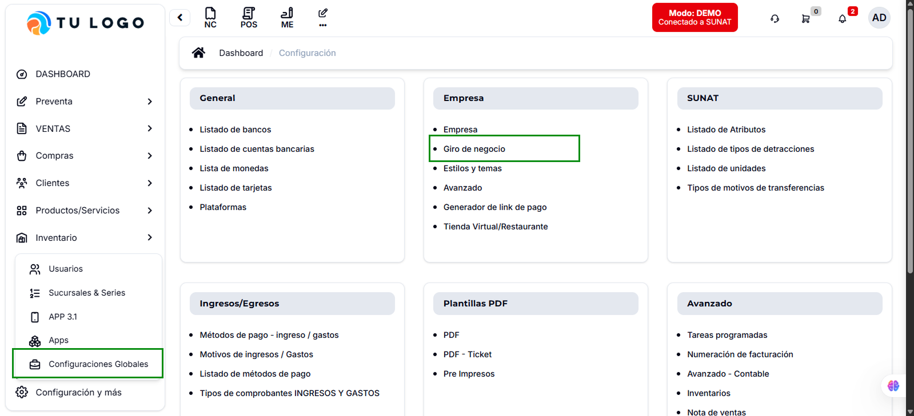
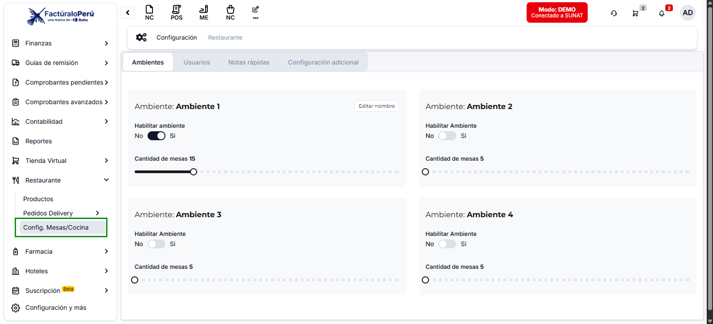
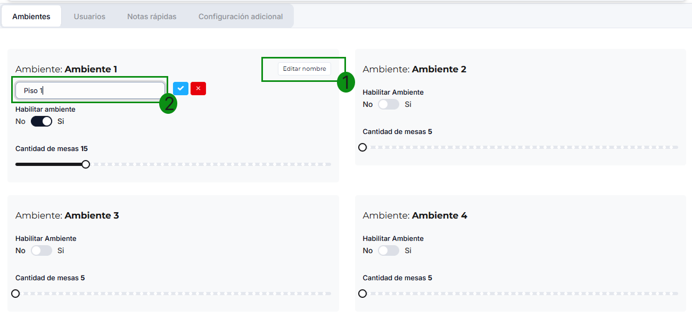
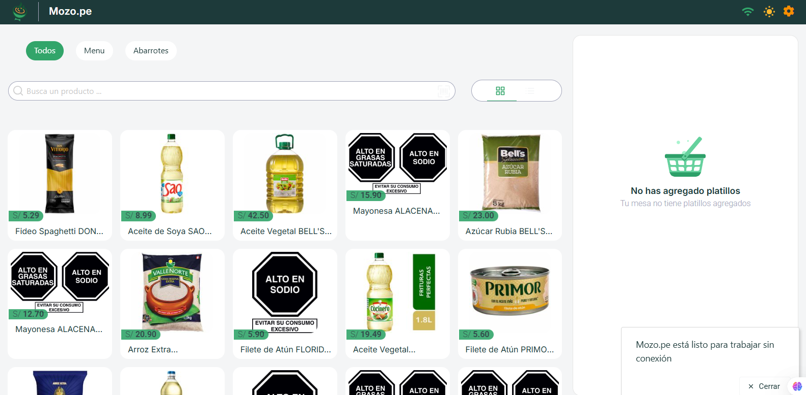
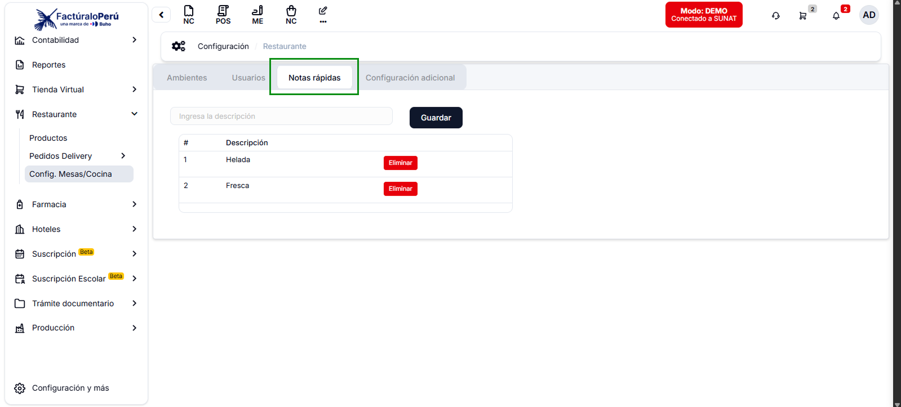
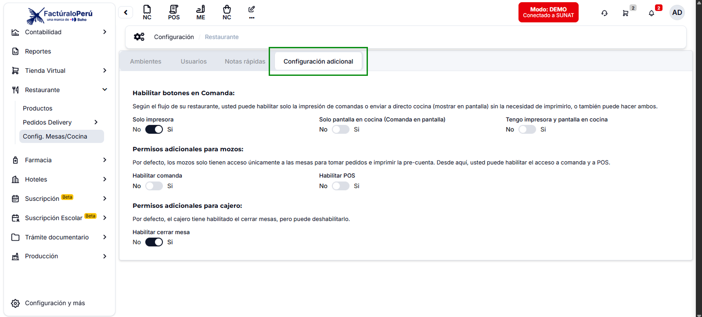
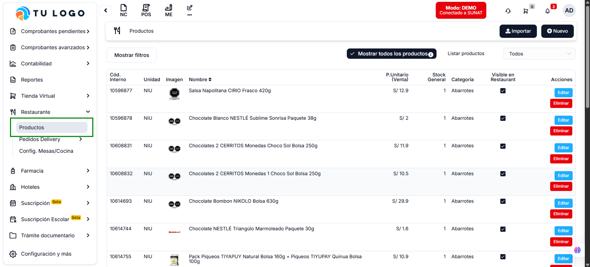
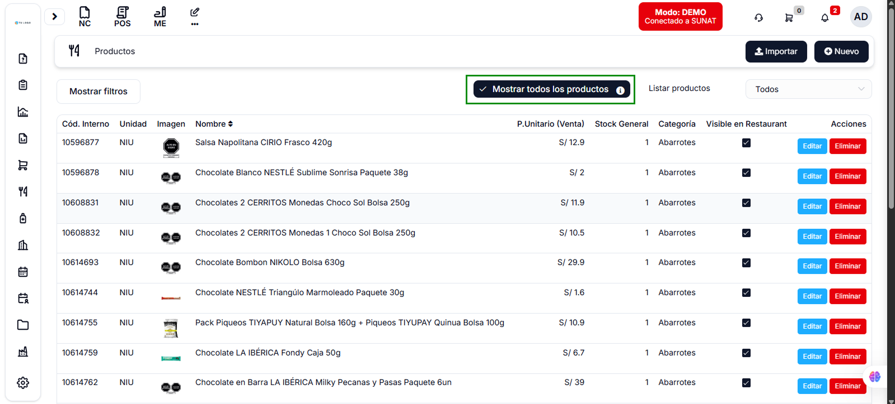
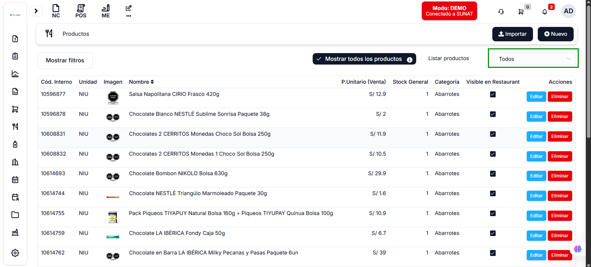
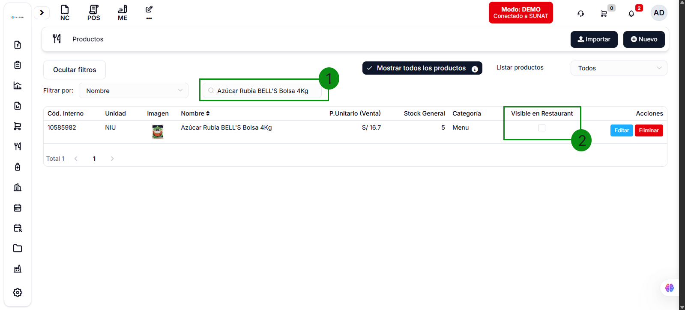

# Mozo: Configuración Previa

## Configuración en el Facturador Pro 8 o Pro X

### Paso 1: Configurar Giro de Negocio

Para comenzar con la **configuración previa de Mozo**, siga estos pasos:

1. En el menú lateral izquierdo, dirígete a la sección **Configuración y más**
2. Selecciona **Configuraciones Globales**
3. Navega a **Empresa** > **Giro de Negocio**

4. Dentro del submódulo, busca la opción **Restaurante**
5. Haz clic derecho sobre la opción para marcarla

### Paso 2: Configurar Sucursal con IGV - Ley 31556

Ahora configuraremos la sucursal que utilizará Mozo:

1. En el menú lateral, ve nuevamente a **Configuración y más**
2. Selecciona **Sucursales & Series**
3. Elige la sucursal que se utilizará en Mozo
4. Haz clic en **Editar**

5. Activa la opción **Sujeto al IGV - Ley 31556**
6. Guarda los cambios

:::danger Obligatorio para Restaurantes
Esta opción es **obligatoria** para restaurantes porque:
- ✅ Permite la correcta emisión de comprobantes de pago con IGV
- ✅ Garantiza el cumplimiento de la Ley 31556
- ✅ Asegura la validez legal de las transacciones
- 📊 **Aplica el 10% de IGV** para servicios de restaurante
:::

:::info Información Importante
Mozo utilizará la **sucursal activa** en ese momento en el sistema de facturación. Asegúrate de tener la sucursal correcta activada antes de usar Mozo.
:::

---

## Configuración del Módulo Restaurante

Una vez completados los pasos anteriores, procede con la configuración específica del módulo Restaurante.

Nos ubicamos en el menú lateral izquierdo y buscamos el módulo de **Restaurante**, submódulo **Config. Mesas/Cocina**

## Ambientes de Trabajo

### 📍 Configuración de Ambientes
- **Ambientes disponibles:** 4 (2 activados por defecto)
- **Personalización:** Solo se pueden editar los nombres de ambientes activados
- **Ejemplo:** Cambiar "Ambiente 1" → "Piso 1"

> **Nota:** Los nombres configurados se visualizarán directamente en la plataforma Mozo

---

## 👥 Gestión de Usuarios

### Tipos de Usuario Preconfigurados
- **🔑 Administrador:** Acceso completo a todos los módulos
- **💰 Caja:** Acceso a módulos POS, Mesa y Pedidos
- **👨‍🍳 Cocina:** Acceso específico para área de cocina
- **🍽️ Mozo:** Acceso limitado según permisos configurados

import Admonition from '@theme/Admonition';

<Admonition type="danger" title="¡Atención!">
  Si el usuario no tiene un <b>rol configurado</b> en la plataforma de Mozo, <b>no aparecerán los módulos asociados</b> en la aplicación. 
   

  Es indispensable asignar uno de los cuatro roles mencionados anteriormente (Administrador, Caja, Cocina o Mozo) para que el usuario pueda acceder correctamente a las funcionalidades del sistema.
</Admonition>

### Credenciales Editables
| Rol | PIN | Contraseña | Gmail |
|-----|-----|------------|-------|
| Administrador | ✅ | ✅| ❌ |
| Otros roles | ✅ | ✅ | ❌ |

> **💡 Importante:** El PIN será utilizado en funcionalidades específicas que se explicarán mas adelante

---

## 📝 Notas Rápidas

### Funcionalidades
- **Crear notas:** Agregar descripciones personalizadas
- **Gestión:** Administrar notas existentes
- **Acceso rápido:** Disponible desde la interfaz principal

---

## ⚙️ Configuración Adicional

### 🖨️ Botones en Comanda
Configure dónde aparecerán los botones de comanda:

- **Solo Impresora** ⬜
- **Solo Pantalla de Cocina** ⬜  
- **Impresora + Pantalla de Cocina** ⬜

> **Visualización:** Estos ajustes se reflejan directamente en la plataforma Mozo

### 🔐 Permisos Adicionales para Mozo
Por defecto, el usuario Mozo tiene acceso limitado:

| Permiso | Estado Default | Descripción |
|---------|----------------|-------------|
| **Habilitar Comanda** | ❌ | Acceso a funciones de comanda |
| **Habilitar POS** | ❌ | Acceso a punto de venta |
| **Acceso a Mesas** | ✅ | Gestión básica de mesas |

### 💰 Permisos Adicionales para Cajero

| Permiso | Estado | Descripción |
|---------|--------|-------------|
| **Cerrar Mesa** | ✅ | Permite finalizar el servicio de mesa |

---

## 🍽️ Gestión de Productos

En el menu lateral izquierdo esta vez vamos a ingresar al submodulo de **Productos** dentro de **Restaurante**

### Visibilidad en Restaurante
- **Productos visibles:** Lista de productos activos en el sistema
- **Activación masiva:** Hacer visibles todos los productos de una vez

:::danger Requisito
Solo se activan productos con código interno asignado
:::

### 🔍 Filtros Disponibles

- **Todos** - Muestra todos los productos
- **Visibles** - Solo productos activos en restaurante
- **Ocultos** - Productos no disponibles en la plataforma

### Activación Individual
Para productos específicos que no están visibles:
1. Localizar el producto en la lista
2. Activar desde el panel individual

3. Verificar que aparezca en "Visibles"

---

## ✅ Verificación de Configuración

### Checklist Final
- [ ] Ambientes nombrados correctamente
- [ ] Usuarios creados con roles apropiados
- [ ] Notas rápidas configuradas
- [ ] Permisos de comanda establecidos
- [ ] Productos visibles en restaurante
- [ ] Filtros de productos funcionando

---

## 🎯 Próximos Pasos

Esta configuración previa es fundamental para el correcto funcionamiento de Mozo. En los siguientes tutoriales aprenderás:

- 📱 Uso de la plataforma Mozo
- 🏃‍♂️ Flujo de trabajo para mozos
- 💳 Procesos de caja y cobro
- 🍳 Gestión de cocina y comandas

---

> **📞 Soporte:** Para dudas adicionales, contacta al área de soporte BUHO  
> **🔄 Actualizaciones:** Mantén tu sistema actualizado para acceder a nuevas funcionalidades