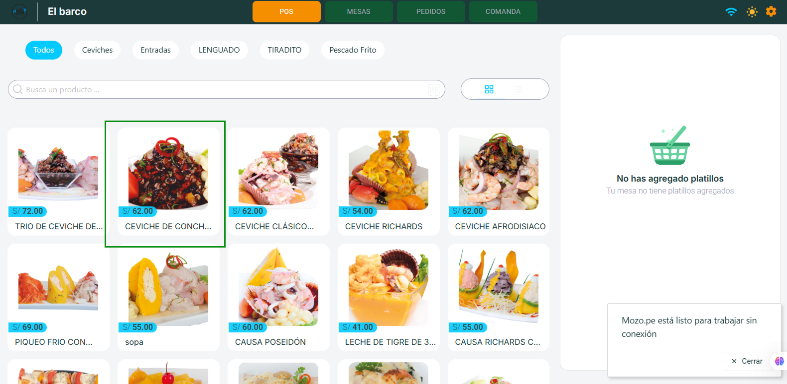
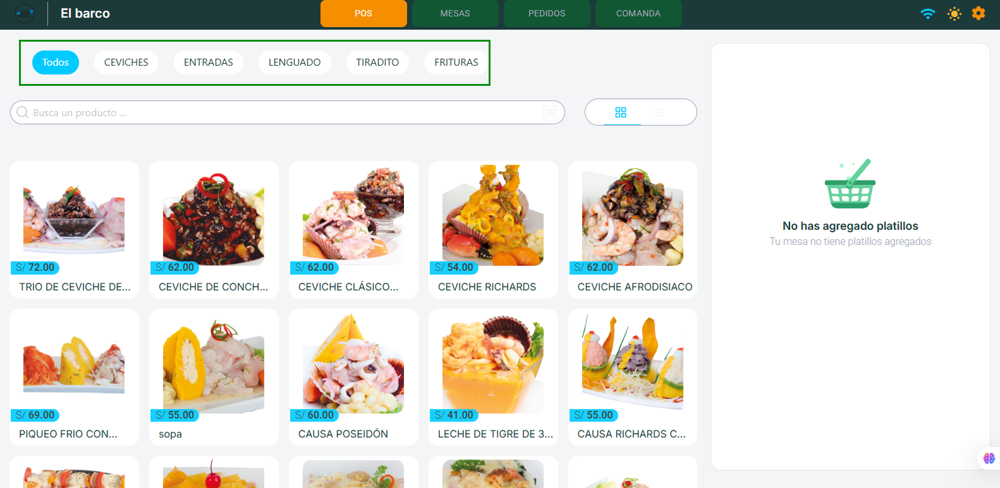
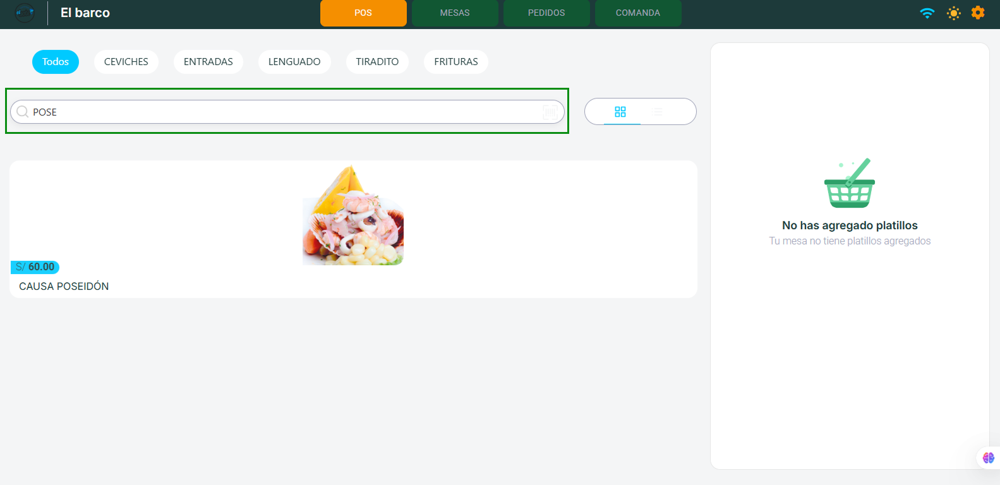
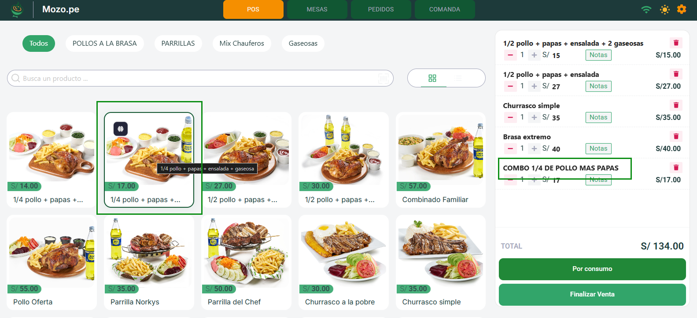
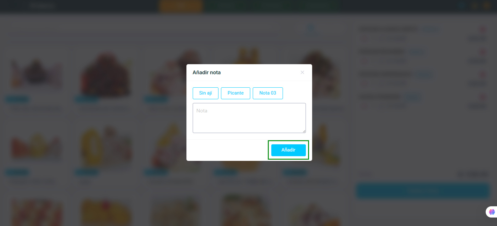
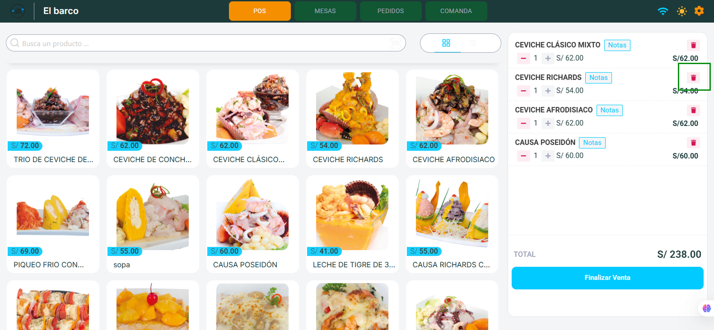
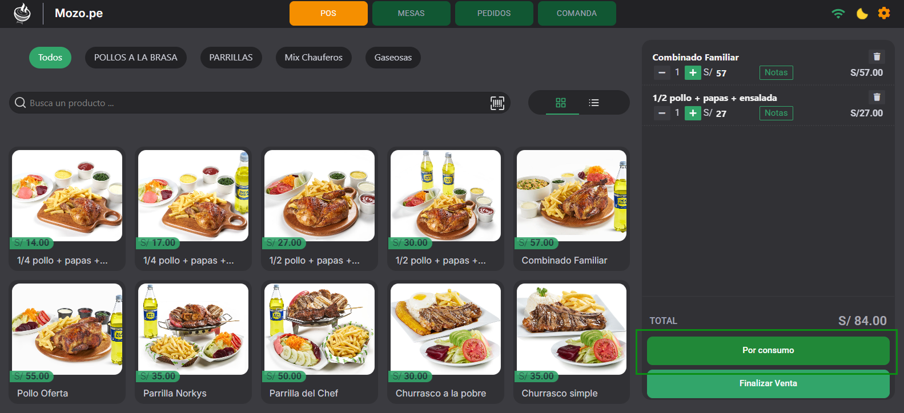

import DocsCard from '/src/components/global/DocsCard';
import DocsCards from '/src/components/global/DocsCards';

# Módulo POS (Punto de Venta)

> 🎯 **Descripción General**
>
> El **módulo POS (Punto de Venta)** está diseñado para gestionar **pedidos rápidos y ventas sin mesa** (para llevar o mostrador). Desde aquí el usuario puede **seleccionar productos, editar precios puntuales y generar comprobantes** de manera ágil.

## 🖥️ Interfaz del Sistema

La pantalla del POS se divide en **dos secciones principales**:

### 📦 1. Panel de Productos

**Características principales:**
- ✅ Muestra el catálogo completo de productos con **imagen, nombre y precio**

- 🔍 **Filtrado por categorías** (Ejemplo: Abarrotes, Lácteos, Gaseosas, etc.)

- 🔎 **Buscador integrado** para localizar productos específicos rápidamente

- 👀 **Dos vistas disponibles:**
  - **Grid**: Cuadrícula con imágenes grandes para identificación visual
  - **Lista**: Vista compacta para navegación rápida

  

### 🛒 2. Carrito de Venta

**Panel de gestión de pedidos** que incluye:

#### 📋 Información por producto:
- **Cantidad**: Botones `+` y `-` para ajustar unidades

  

- **Precio unitario**: Editable (solo afecta al comprobante actual)

  

- **Nombre del Producto**: Editable (solo afecta al comprobante actual)

  

- **Botón Notas**: Añadir observaciones pre-configuradas

  

  Recuerde que estas se configuraron en el paso de **Mozo: Configuración Previa**, puede verificarlo en el siguiente [articulo](https://manual.uio.la/Pro7/Mozo.pe/mozo_config_previa#-notas-r%C3%A1pidas)

    

- **Botón Eliminar**: Retirar producto del carrito

    

#### 💰 Panel de totales:

El panel inferior muestra el **TOTAL acumulado** de la venta en tiempo real y ofrece **dos opciones para finalizar la transacción**:

<DocsCards>
  <DocsCard 
    header="🍽️ Por Consumo"
    href="#%EF%B8%8F-botón-por-consumo"
  >
    
Genera un comprobante simplificado con un solo ítem que agrupa todos los productos del carrito. Ideal para ventas rápidas donde no se requiere detalle.

  </DocsCard>

  <DocsCard
    header="✅ Finalizar Venta"
    href="#-botón-finalizar-venta"
  >
    
Genera un comprobante detallado con cada producto listado individualmente, preservando cantidades, precios y notas específicas.

  </DocsCard>
</DocsCards>

---

## ⚙️ Funcionalidades del Sistema

### 🎯 Selección de Productos
- **Clic directo**: Al hacer clic en cualquier producto, se agrega automáticamente al carrito
- **Múltiples unidades**: Posibilidad de añadir varias unidades del mismo producto
- **Adición rápida**: Interfaz optimizada para ventas ágiles

### 📝 Sistema de Notas
- **Personalización**: Asignar notas específicas a cada ítem del pedido
- **Pre-configuración**: Las notas deben estar previamente configuradas en el sistema administrativo
- **Flexibilidad**: Ideal para especificaciones especiales o modificaciones

### 💲 Edición de Precios por Comprobante
- **Modificación puntual**: Editar el precio de productos en el comprobante actual
- **Sin afectación**: Los cambios NO alteran el precio original del producto en el sistema
- **Aplicación temporal**: Solo válido para la venta en curso

### 🍽️ Botón "Por Consumo"
**Funcionalidad de resumen simplificado:**

- **Conversión automática**: Transforma todos los ítems del carrito en un producto único
- **Comprobante simplificado** que muestra:
  - Un solo ítem denominado **"Por Consumo"**

  - El total general de todos los productos sumados

::::danger Importante
Una vez activado, no se pueden editar precios individuales
::::

**¿Cuándo usar este botón?**
- Ventas rápidas en mostrador
- Cuando el cliente no requiere detalle de productos
- Para agilizar el proceso de facturación
- Comprobantes simplificados para consumo interno

### ✅ Botón "Finalizar Venta"
**Generación de comprobante detallado:**

- **Listado completo**: Cada producto aparece de manera individual
- **Información preservada**: Mantiene cantidades, precios modificados y notas
- **Comprobante profesional**: Formato estándar con todos los detalles de venta

**¿Cuándo usar este botón?**
- Ventas que requieren desglose de productos
- Cuando el cliente solicita factura detallada
- Para mantener registro preciso del inventario
- Comprobantes con notas o modificaciones de precio

---

## 🚀 Flujo de Trabajo Recomendado

### Paso 1: Selección de Productos
1. Utilizar filtros por categoría para encontrar productos
2. Usar el buscador para localización rápida
3. Hacer clic en los productos deseados

### Paso 2: Configuración del Pedido
1. Ajustar cantidades usando los botones `+` y `-`
2. Modificar precios si es necesario
3. Añadir notas específicas a los ítems

### Paso 3: Finalización
1. Verificar el total acumulado
2. Elegir entre:
   - **Por Consumo**: Para comprobantes simplificados
   - **Finalizar Venta**: Para comprobantes detallados

---

## 💡 Consejos de Uso

- 🔄 **Vista Grid**: Ideal para productos con imágenes distintivas
- 📄 **Vista Lista**: Perfecta para catálogos extensos
- ⚡ **Filtros**: Acelera la búsqueda en inventarios grandes
- 📝 **Notas**: Configure previamente las más utilizadas en el sistema
- 💰 **Precios**: Use la edición puntual para descuentos o promociones específicas

---

> ✨ **El módulo POS está optimizado para maximizar la eficiencia en ventas rápidas, manteniendo la flexibilidad necesaria para personalizar cada transacción según las necesidades del cliente.**