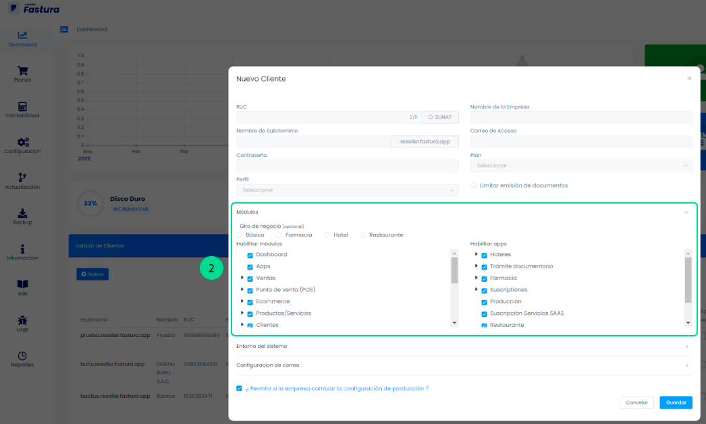
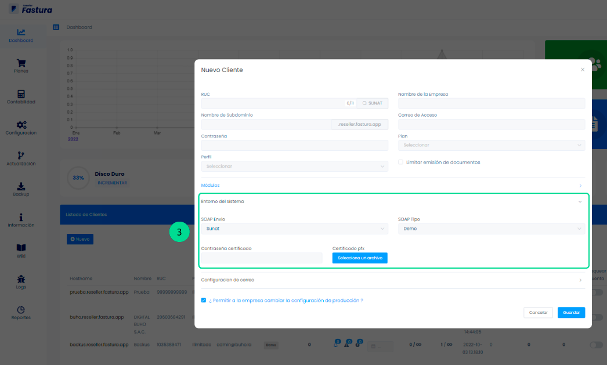

# Crear cuenta

En este artículo veremos los pasos necesarios para crear una cuenta y así su cliente podrá acceder y empezar a usar el sistema de facturación. Puede crear un máximo de cuentas según su plan actual de reseller (Si usted compró el código fuente no tiene limites en la creación de cuentas).

Iniciamos entrando a nuestro sistema Administrador donde visualizaremos el **Dashboard**

Luego buscar la sección **Listado de Clientes** y dar click en el botón **nuevo**.

## Datos principales

Posteriormente aparecerá un formulario a llenar con los siguientes campos:

1. **RUC:** Al presionar el botón sunat se completará automáticamente el campo nombre de la empresa. También puede escribirlo manualmente.
2. **Nombre del subdominio:** Este sera la URL (link) de acceso de su cliente a su sistema.
3. **Correo de acceso:** Puede ser el correo de su cliente o un correo inventado. Este email solo sirve como dato de acceso, no se envía ningún tipo de información a este correo.
4. **Contraseña:** Recuerde proporcionar estos datos a su cliente para que pueda acceder.
Seleccionamos el plan y opción limitar emisión de documentos.

## Módulos

**En la sección módulos:** Tenemos diferentes opciones, para poder crear diferentes vistas dentro de nuestra cuenta.

:::info IMPORTANTE

Usted puede personalizar los módulos según las necesidades de su cliente o según los planes que usted ha establecido. Por ejemplo en el plan más básico usted decidió que los clientes no tendrían acceso al punto de Venta (POS) entonces usted puede desabilitar ese módulo.

:::

## Entorno del sistema

En la sección entorno del sistema

Se encontrará los campos de:

- **SOAP envío:** Escoger según corresponda Sunat u Ose
- **SOAP tipo:** Este es el tipo de ambiente que usará su cliente. Puede ser Demo o Producción:
    - Al escoger Demo (Entorno de prueba): Los comprobantes NO son enviados a SUNAT y por lo tanto no tienen validez fiscal.
    - Al escoger Producción (Entorno real y funcional): Los comprobantes SI son enviados a SUNAT y son válidos.

:::danger IMPORTANTE:
Es posible que su cliente desee probar el sistema primero, para este caso le recomendamos que le habilite un entorno de prueba con un RUC inventado ya que si crea una cuenta con el RUC real y después quiera pasar al entorno de producción el sistema tendrá historial y registros de productos, inventarios, reportes etc. (estos datos no pueden ser eliminados).
:::

Asimismo, para obtener el usuario secundario y contraseña de la conexión con sunat, en este **[video](https://www.youtube.com/watch?v=PZ028aDpR3A)** encontrarás los pasos para realizarlo.

## Configuración de correo

Esta configuración le ayudará a sus clientes a enviar los comprobantes electrónicos por correo. Para realizar la configuración puedes seguir estos pasos.

Antes de finalizar usted puede permitir o no que la empresa pueda cambiar de demo a producción desde su cuenta.

Luego de esto le da en el botón **Guardar** y su nueva cuenta estará lista para ser usada.
