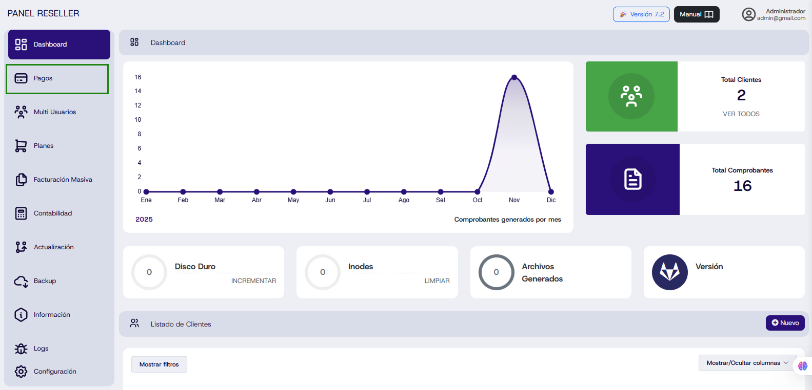
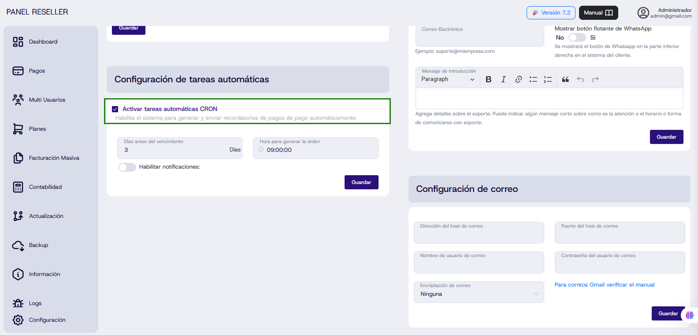
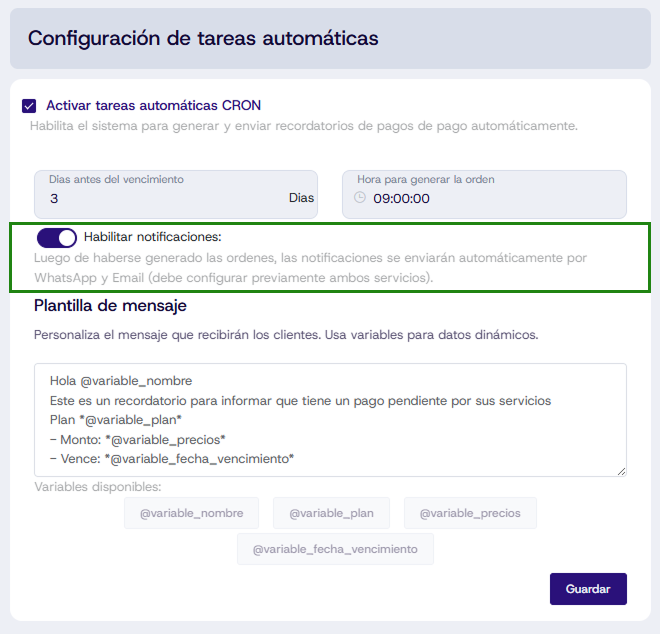
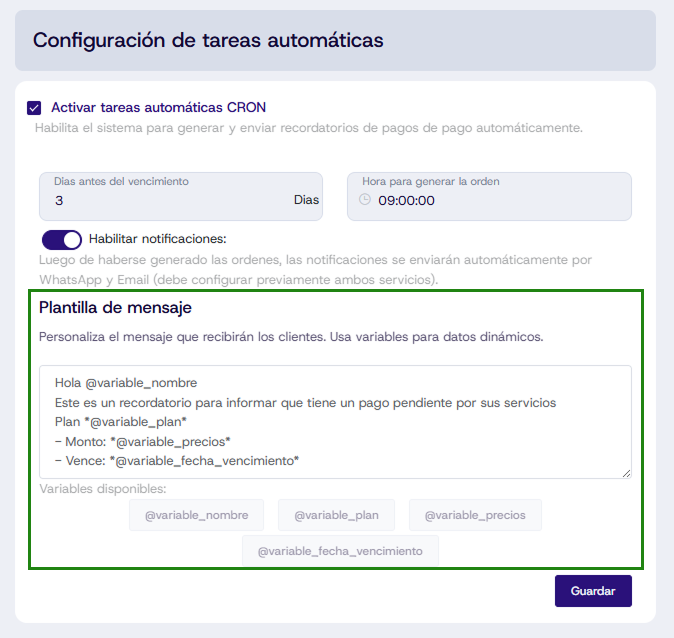
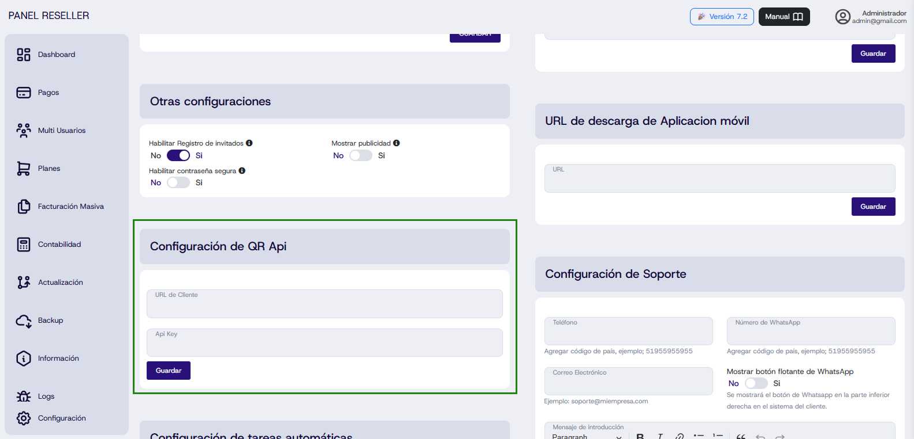
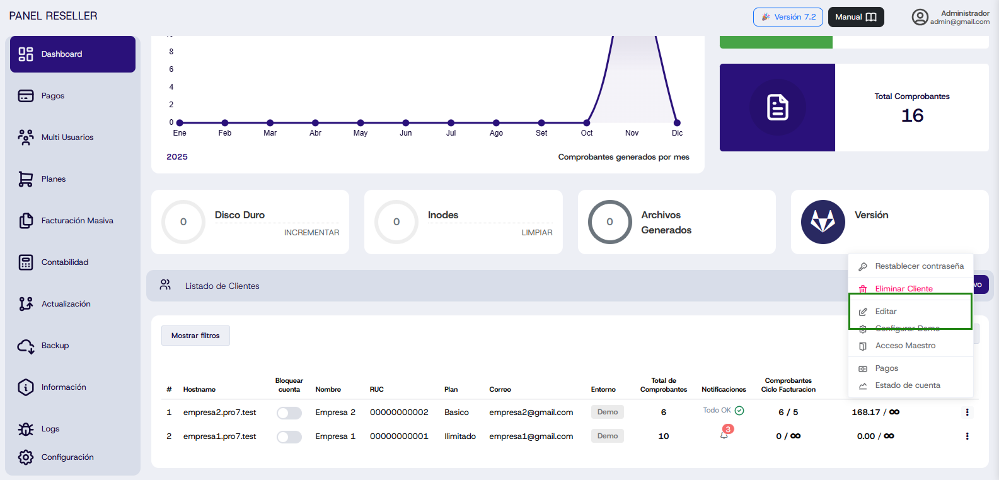
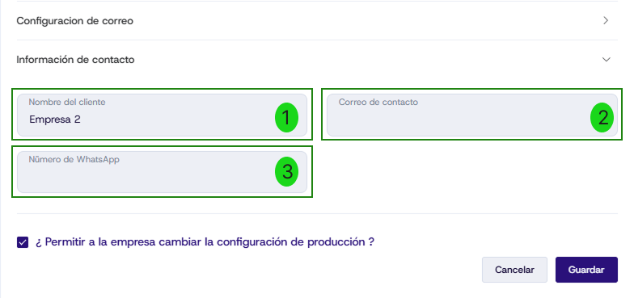
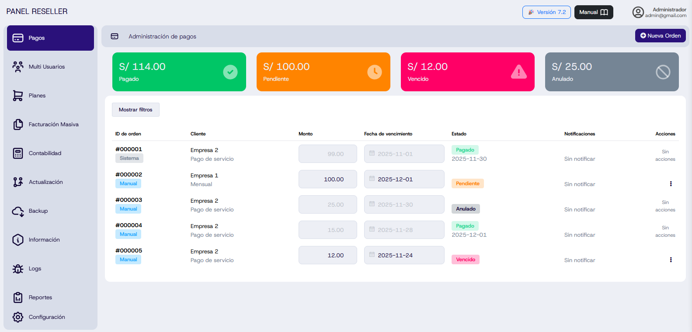

import DocsCard from '/src/components/global/DocsCard';
import DocsCards from '/src/components/global/DocsCards';

# Módulo de Pagos

<head>
  <title>Módulo de Pagos - Sistema de Gestión de Órdenes de Pago</title>
  <meta
    name="description"
    content="Aprende a configurar y gestionar órdenes de pago automáticas con notificaciones por correo y WhatsApp en el Panel Administrador."
  />
</head>

## Introducción

El **Módulo de Pagos** es una herramienta diseñada para automatizar la gestión de órdenes de pago de tus clientes. Este sistema permite generar recordatorios automáticos antes de la fecha de vencimiento, enviar notificaciones por correo electrónico y WhatsApp, y llevar un control detallado del estado de cada orden.

Con este módulo podrás:
- Crear órdenes de pago manuales o automáticas
- Configurar notificaciones personalizadas
- Realizar seguimiento de pagos pendientes, vencidos, pagados y anulados
- Automatizar el proceso de cobro sin bloquear los sistemas de tus clientes

---

## 🚀 Acceso al Módulo

Para acceder al módulo de Pagos, dirígete al Panel Administrador y selecciona la opción **"Pagos"** en el panel lateral izquierdo.



:::info Primera Vez
Al ingresar por primera vez al módulo, aparecerá un mensaje indicando que debes activar las tareas automáticas CRON para que el sistema funcione correctamente.
:::


---

## ⚙️ Configuración Inicial

### Paso 1: Activar Tareas Automáticas CRON

Para habilitar el funcionamiento del módulo, debes activar las tareas automáticas CRON desde la sección de **Configuración**.

**Pasos a seguir:**

1. Dirígete a la sección **"Configuración"** en la parte baja del panel lateral izquierdo


2. Busca la opción **"Activar tareas automáticas CRON"**



3. Activa el interruptor para habilitar las tareas automáticas


### Configuración de Parámetros CRON

Una vez activado, podrás configurar los siguientes parámetros:

- **Días antes del vencimiento**: Define cuántos días antes de la fecha de vencimiento se generará la orden (por defecto: 3 días)
- **Hora para generar la orden**: Establece la hora exacta en que se generarán las órdenes automáticamente (por defecto: 09:00:00)


---

## 📧 Configuración de Notificaciones

### Habilitar Notificaciones Automáticas

Para que el sistema envíe notificaciones automáticas a tus clientes, debes habilitar esta opción en la sección de tareas automáticas.

**Pasos:**

1. En **"Configuración de tareas automáticas"**, activa el interruptor **"Habilitar notificaciones"**



2. Una vez activado, aparecerá una **plantilla de mensaje** que podrás personalizar según tus necesidades



### Plantilla de Mensaje Personalizable

La plantilla incluye variables dinámicas que se reemplazarán automáticamente con la información de cada cliente:

```
Hola @variable_nombre
Este es un recordatorio para informar que tiene un pago pendiente por sus servicios
Plan *@variable_plan*
- Monto: *@variable_precios*
- Vence: *@variable_fecha_vencimiento*
```

**Variables disponibles:**
- `@variable_nombre`: Nombre del cliente
- `@variable_plan`: Plan contratado
- `@variable_precios`: Monto de la orden
- `@variable_fecha_vencimiento`: Fecha límite de pago

:::tip Personalización
Puedes editar esta plantilla libremente para adaptarla al tono y estilo de comunicación de tu empresa.
:::

:::warning Importante
Para que las notificaciones funcionen correctamente, debes configurar previamente los servicios de **correo electrónico** y **WhatsApp**.
:::

---

## 📮 Configuración de Correo Electrónico

### Requisitos Previos

Para enviar notificaciones por correo, necesitas configurar los datos de tu servidor SMTP.


**Información requerida:**

1. **Dirección del host de correo**: Servidor SMTP (ejemplo: smtp.gmail.com)
2. **Puerto del host de correo**: Puerto de conexión (ejemplo: 587)
3. **Nombre de usuario de correo**: Tu dirección de correo completa
4. **Contraseña del usuario de correo**: Contraseña de aplicación
5. **Encriptación de correo**: Tipo de seguridad (TLS/SSL)

### Ejemplo de Configuración con Gmail


**Configuración típica para Gmail:**

```
Dirección del host: smtp.gmail.com
Puerto: 587
Usuario: tucorreo@gmail.com
Contraseña: [Contraseña de aplicación]
Encriptación: TLS
```

### Generar Contraseña de Aplicación en Gmail

:::danger Requisito Crítico
Debes tener activada la **verificación en dos pasos** en tu cuenta de Google para poder generar contraseñas de aplicación.
:::

**Pasos:**

1. Accede a [Contraseñas de aplicación de Google](https://accounts.google.com/v3/signin/challenge/pwd?TL=ANzgctSBtV9uMgbrh6QIq2bhafWwkeD29JRLoiT2yQybImHvpjX84AHK3MUn6VrS&authuser=0&cid=2&continue=https%3A%2F%2Fmyaccount.google.com%2Fapppasswords)
2. Inicia sesión con tu cuenta de Google
3. Genera una nueva contraseña de aplicación
4. Copia la contraseña generada y pégala en el campo correspondiente

:::tip Documentación Detallada
Para más información sobre configuración SMTP segura, consulta el [manual de configuración SMTP](https://manual.uio.la/ProX/Guias-Adicionales/configuracion-smtp-segura#1-configuraci%C3%B3n-del-protocolo-de-seguridad)
:::

---

## 📱 Configuración de WhatsApp (QRAPI)

Para enviar notificaciones por WhatsApp, necesitas tener una cuenta activa en la plataforma **QRAPI**.

### Obtener Credenciales de QRAPI

**Información requerida:**

1. **URL de Cliente**: Tu dirección personalizada de QRAPI
2. **API Key**: Clave de autenticación

### Ejemplo de Configuración



**URL de Cliente:**
```
https://cliente1.qrapi.com
```

:::info Importante
La URL debe ingresarse **sin la barra diagonal (/)** al final.
:::

**Obtener API Key:**

1. Inicia sesión en tu cuenta de QRAPI
2. Conecta tu número de WhatsApp a la plataforma
3. Haz clic en tu número conectado
4. Copia el **API Key** generado
5. Pégalo en el campo correspondiente del sistema

---

## 👥 Configuración de Clientes

Antes de crear órdenes de pago, debes configurar la información de contacto de tus clientes.

### Acceder a la Edición de Clientes

1. Dirígete al **Dashboard**
2. Selecciona **"Listado de Clientes"**


3. Ubica el cliente que deseas configurar
4. En la columna **"Acciones"**, haz clic en **"Editar"**



### Información de Contacto

En el formulario de edición, encontrarás una nueva sección llamada **"Información de contacto"**:


**Campos requeridos:**

1. **Nombre del cliente**: Nombre completo de la empresa o persona
2. **Correo de contacto**: Dirección de correo donde llegarán las notificaciones
3. **Número de WhatsApp**: Número con código de país (ejemplo: +51995955955)



:::warning Diferencia Importante
Esta configuración de correo es exclusiva para el **módulo de Pagos**. No confundir con la configuración de correo del sistema que se usa para otros fines.

- **Correo del sistema**: Para notificaciones generales del panel
- **Correo de contacto del cliente**: Para recibir órdenes de pago específicas
:::

**Guardar Cambios:**

Una vez completados todos los campos, haz clic en **"Guardar"** para aplicar los cambios.

---

## 💳 Crear Órdenes de Pago

### Acceder al Formulario de Nueva Orden

En el módulo de Pagos, haz clic en el botón **"+ Nueva Orden"** ubicado en la esquina superior derecha.


### Formulario de Creación

Se desplegará un modal con los siguientes campos:


**Campos del formulario:**

1. **Empresa**: Selecciona el cliente al que generarás la orden de pago
2. **Fecha de vencimiento**: Establece la fecha límite de pago
3. **Monto**: Ingresa el valor de la orden
4. **Concepto** (opcional): Describe el motivo de la orden

### Opciones de Creación

Al finalizar, tienes dos opciones:

<DocsCards>
  <DocsCard 
    header="Crear Orden"
  >
    <p>Solo crea la orden sin enviar notificaciones. El cliente no recibirá avisos inmediatos.</p>
  </DocsCard>

  <DocsCard
    header="Crear y Notificar Orden"
  >
    <p>Crea la orden y envía automáticamente notificaciones por correo y WhatsApp al cliente.</p>
  </DocsCard>
</DocsCards>

:::info Nota Importante
Este procedimiento **no bloquea automáticamente** los sistemas de tus clientes. Es solo un recordatorio de pago.
:::

---

## 📊 Gestión y Seguimiento de Órdenes

### Visualización de Órdenes

Una vez creadas, todas las órdenes aparecerán en la tabla principal del módulo de Pagos.

### Estados de las Órdenes

El sistema utiliza un código de colores para identificar el estado de cada orden:

| Estado | Color | Descripción |
|--------|-------|-------------|
| **Pagado** | 🟢 Verde | La orden ha sido marcada como pagada |
| **Pendiente** | 🟠 Naranja | La orden está activa y dentro del plazo |
| **Vencido** | 🔴 Rojo | La fecha de vencimiento ha pasado sin pago |
| **Anulado** | ⚫ Gris | La orden ha sido cancelada |


### Información de Cada Orden

La tabla muestra la siguiente información:

- **ID de orden**: Número único de identificación
- **Cliente**: Empresa asociada
- **Monto**: Valor de la orden
- **Fecha de vencimiento**: Fecha límite de pago
- **Estado**: Estado actual con código de color
- **Notificaciones**: Indica si se han enviado avisos
- **Acciones**: Opciones disponibles para gestionar la orden

---

## 🔧 Acciones Disponibles

En la columna **"Acciones"** de cada orden, tienes las siguientes opciones:


### 1. Notificar

Envía manualmente una notificación al cliente por correo y WhatsApp, recordándole sobre la orden pendiente.

**Cuándo usar:**
- Si el cliente no recibió la notificación automática
- Para enviar un recordatorio adicional antes del vencimiento
- Si hubo cambios en la orden y necesitas informar al cliente

### 2. Pagar

Marca la orden como pagada cuando el cliente haya realizado el pago correspondiente.

**Proceso:**
1. Haz clic en **"Pagar"**
2. El sistema actualizará el estado a "Pagado" (verde)
3. Se registrará la fecha de pago automáticamente

### 3. Anular

Cancela una orden de pago que ya no es válida o necesaria.

**Cuándo usar:**
- Si se generó una orden por error
- Si el cliente ya no requiere el servicio
- Si hubo cambios en los términos del contrato

:::warning Atención
Una vez anulada, la orden no se puede reactivar. Deberás crear una nueva orden si es necesario.
:::

---

## 📈 Panel de Estadísticas

En la parte superior del módulo encontrarás un resumen visual con el total de cada estado:



**Información mostrada:**

- **S/ XXX.XX Pagado** (Verde): Total en órdenes pagadas
- **S/ XXX.XX Pendiente** (Naranja): Total en órdenes activas
- **S/ XXX.XX Vencido** (Rojo): Total en órdenes vencidas
- **S/ XXX.XX Anulado** (Gris): Total en órdenes canceladas

Este resumen te permite visualizar rápidamente el estado financiero de tus clientes y detectar órdenes que requieren seguimiento.

---

## 🔍 Filtros y Búsqueda

Para facilitar la gestión de grandes cantidades de órdenes, el sistema ofrece opciones de filtrado:

**Filtros disponibles:**

- Por estado (Pagado, Pendiente, Vencido, Anulado)
- Por cliente
- Por rango de fechas

Haz clic en **"Mostrar filtros"** para acceder a estas opciones.

---

## ✅ Checklist de Configuración

Antes de comenzar a usar el módulo de Pagos, asegúrate de completar todos estos pasos:

- [ ] Activar tareas automáticas CRON
- [ ] Configurar días antes del vencimiento y hora de generación
- [ ] Habilitar notificaciones automáticas
- [ ] Configurar servidor SMTP para correo electrónico
- [ ] Generar contraseña de aplicación en Gmail (si usas Gmail)
- [ ] Configurar cuenta de QRAPI para WhatsApp
- [ ] Conectar número de WhatsApp en QRAPI
- [ ] Obtener API Key de QRAPI
- [ ] Configurar información de contacto de cada cliente
- [ ] Personalizar plantilla de mensaje de notificación
- [ ] Realizar prueba con orden de pago de ejemplo

---

## 💡 Buenas Prácticas

### Recomendaciones Generales

1. **Configuración inicial completa**: Asegúrate de completar todos los pasos de configuración antes de crear órdenes
2. **Verificación de contactos**: Confirma que los correos y números de WhatsApp estén correctos
3. **Plantilla profesional**: Personaliza los mensajes manteniendo un tono profesional
4. **Seguimiento periódico**: Revisa regularmente el estado de las órdenes
5. **Documentación**: Mantén registro de los pagos recibidos

### Gestión de Notificaciones

- **Evita spam**: No envíes notificaciones manuales excesivas
- **Horarios adecuados**: El CRON está configurado para enviar en horarios laborales
- **Mensajes claros**: Incluye toda la información necesaria en la plantilla
- **Confirmación**: Verifica que el cliente haya recibido la notificación

### Seguridad

- **Contraseñas seguras**: Usa contraseñas de aplicación, no tu contraseña principal
- **API Keys privadas**: No compartas tus credenciales de QRAPI
- **Verificación en dos pasos**: Mantén activada la seguridad adicional en Gmail
- **Revisión periódica**: Verifica que las configuraciones sigan activas

---

## ❓ Preguntas Frecuentes

<details>
<summary>¿Las órdenes de pago bloquean automáticamente el sistema del cliente?</summary>

No, las órdenes de pago son solo recordatorios. No bloquean automáticamente los sistemas de tus clientes. El bloqueo debe realizarse manualmente si es necesario.
</details>

<details>
<summary>¿Puedo crear órdenes automáticas recurrentes?</summary>

Sí, las tareas automáticas CRON pueden generar órdenes basadas en los planes de tus clientes. Configura los días de anticipación y la hora de generación en la sección de configuración.
</details>

<details>
<summary>¿Qué hago si las notificaciones no llegan?</summary>

Verifica:
1. Que el correo y número de WhatsApp estén correctos
2. Que la configuración SMTP esté completa
3. Que el API Key de QRAPI sea válido
4. Que el número de WhatsApp esté conectado en QRAPI
5. Revisa la bandeja de spam del correo
</details>

<details>
<summary>¿Puedo editar una orden ya creada?</summary>

Actualmente no es posible editar una orden existente. Si necesitas hacer cambios, debes anular la orden actual y crear una nueva con la información correcta.
</details>

<details>
<summary>¿Cuántas notificaciones automáticas se envían?</summary>

El sistema envía una notificación automática según los días configurados antes del vencimiento. Puedes enviar notificaciones manuales adicionales desde el menú de acciones.
</details>

<details>
<summary>¿Se puede cambiar la plantilla de mensaje para cada cliente?</summary>

La plantilla es global para todos los clientes. Sin embargo, las variables dinámicas personalizan el mensaje con la información específica de cada uno.
</details>

<details>
<summary>¿Qué pasa si una orden se vence?</summary>

El sistema automáticamente cambia el estado a "Vencido" (rojo) después de la fecha límite. Puedes seguir gestionándola normalmente, enviando notificaciones o marcándola como pagada cuando corresponda.
</details>

---

## 🛠️ Solución de Problemas

### Las notificaciones no se envían

**Posibles causas y soluciones:**

1. **CRON no activado**
   - Solución: Activa las tareas automáticas en Configuración

2. **Configuración de correo incorrecta**
   - Solución: Verifica servidor SMTP, puerto, usuario y contraseña

3. **Contraseña de aplicación inválida**
   - Solución: Genera una nueva contraseña de aplicación en Gmail

4. **API Key de QRAPI incorrecto**
   - Solución: Verifica y actualiza tu API Key desde la plataforma QRAPI

5. **Número de WhatsApp desconectado**
   - Solución: Reconecta tu número en la plataforma QRAPI

### No aparece el mensaje de CRON

**Solución:**
- Refresca la página del navegador
- Limpia la caché del navegador

### Las órdenes no se generan automáticamente

**Verificar:**
- Que el CRON esté activado
- Que los clientes tengan planes activos
- Que la configuración de días y hora sea correcta
- Que el servidor tenga configuradas las tareas programadas

---

## 🔒 Consideraciones de Seguridad

:::warning Seguridad de Credenciales

1. **Nunca compartas** tus contraseñas de aplicación o API Keys
2. **Usa contraseñas únicas** para cada servicio
3. **Mantén activada** la verificación en dos pasos
4. **Revisa periódicamente** los accesos a tus cuentas
5. **Cambia las contraseñas** cada 3-6 meses
:::

---

