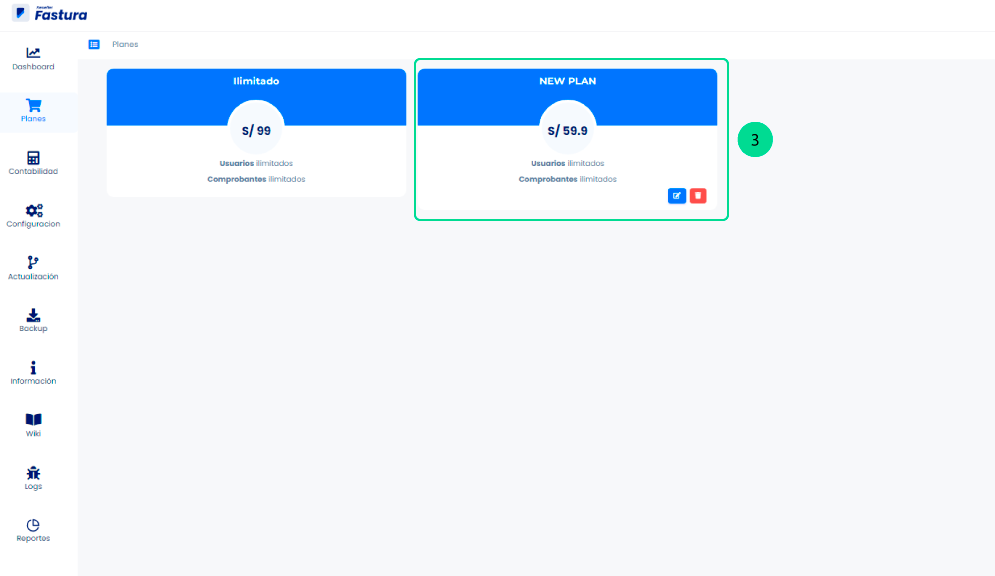

# Planes

Como reseller usted puede crear diferentes tipos de planes según conveniencia, podrá limitar el número de comprobantes o de usuarios por cada plan. Para esto seguimos los siguientes pasos:

Primero ingresamos a **Planes**.

1. Si desea crear un nuevo plan para un cliente lo que debe de hacer es dirigirse al módulo de planes.
2. Estando una vez dentro del módulo de planes, en la parte superior derecha hacer click en el botón **Nuevo**.

## Crear un nuevo plan

Le aparecerá una ventana en donde podrá editar su nuevo plan,en las siguientes secciones:

1. **Nombre:** Coloque el nombre de su preferencia.
2. **Precio:** Asignar el precio que corresponda.
3. **Límite de Usuarios:** Coloque cantidad; en caso que desee la opción ilimitada, solo tiene que seleccionarlo.
4. **Límite de Documentos:** coloque cantidad; en caso que desee la opción ilimitada, solo tiene que seleccionarlo.
5. Presione **GUARDAR**.

## Plan creado

Y podrá observar que el nuevo **plan** se ha creado.

