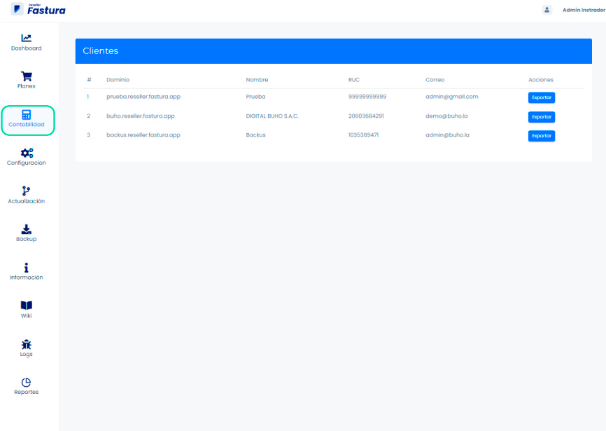
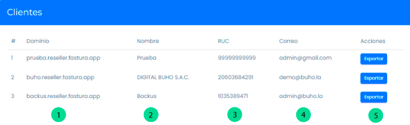

# Contabilidad

En esta área podrás generar los reportes de cada período tributario para ser importados a diversos sistemas contables externos como **CONCAR** , **SISCONT**, **FOXCONT** y **CONTASIS**. Sigue estos pasos para realizarlo:

## Módulo de contabilidad

Ingresa al módulo **contabilidad**,donde encontrará la sección **Clientes**.

## Sección clientes

Dentro de la sección **clientes** se observa las siguientes columnas:

1. **Dominio**
2. **Nombre de la empresa**
3. **RUC**
4. **Correo electrónico de acceso**
5. **Acción Exportar**

## Acciones

En acciones, está disponible el botón **Exportar**.

1. Seleccione periodo a descargar.
2. Seleccione formato de sistemas contables **CONCAR /SISCONT/FOXCONT/CONTASIS**

## Generar

Finalmente, dar click en Generar, y tendrá descargado su documento en formato excel, con datos de los comprobantes de ventas y compras realizadas en el periodo tributario seleccionado.

