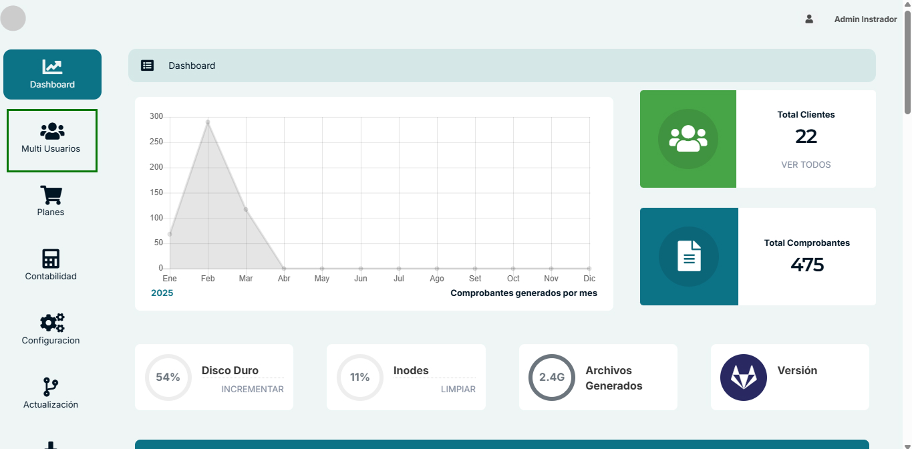
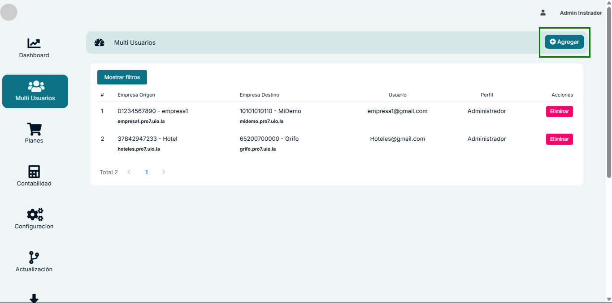
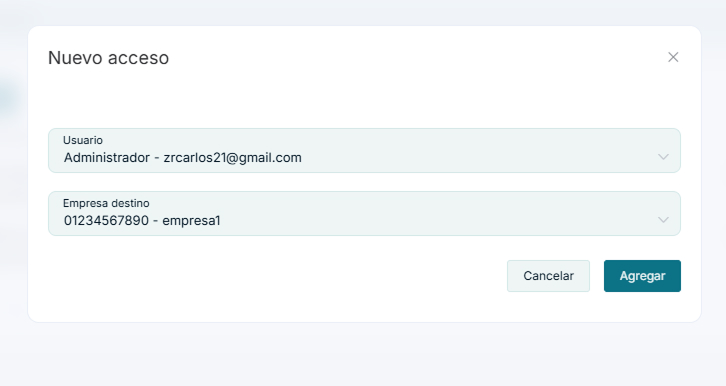
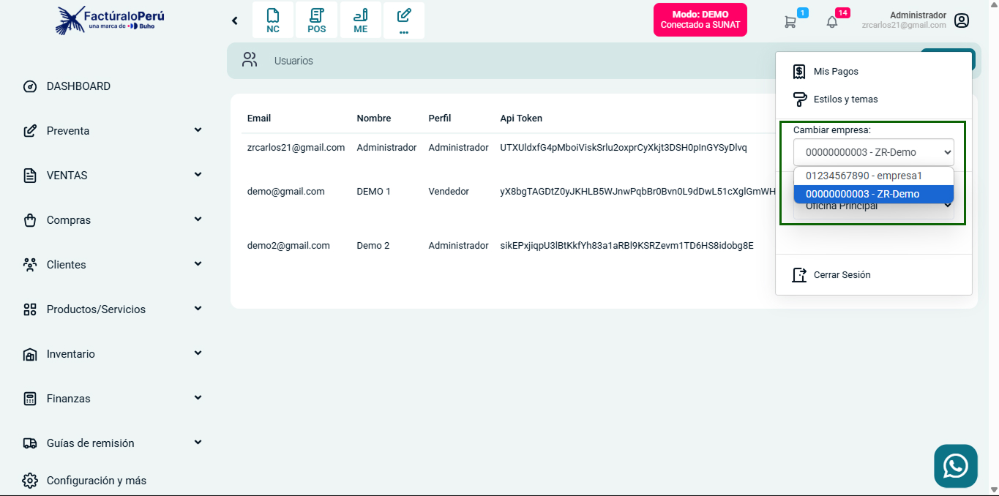
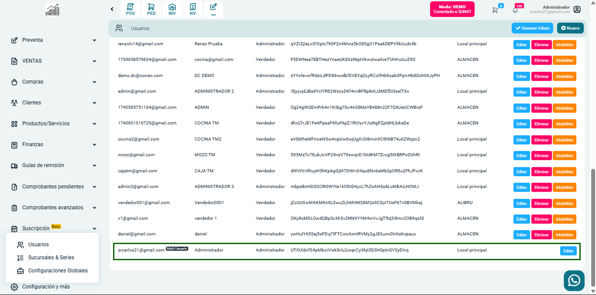

# Multi-usuario: Guía paso a paso

A continuación te presento la documentación para el proceso de creación de un multi-usuario en el sistema, basado en las imágenes compartidas:

## 1. Acceso al panel de administración

Para crear un multi-usuario, primero debes ingresar al panel de administración del sistema con un usuario que tenga permisos de administrador. 

## 2. Navegación a la sección Multi Usuarios

- Desde el menú lateral, navega a la sección "Multi Usuarios", donde podrás gestionar usuarios con acceso a múltiples empresas.

- Verás una tabla que muestra los usuarios actuales que tienen acceso a múltiples empresas, con columnas que indican la Empresa Origen, Empresa Destino, Usuario y Perfil.

## 3. Creación de un nuevo acceso

- Haz clic en el botón verde "Agregar" ubicado en la esquina superior derecha de la pantalla.

- Se abrirá un modal titulado "Nuevo acceso" con dos campos desplegables:

  

  a. **Usuario**: Selecciona el usuario administrador que tendrá acceso .
  
  b. **Empresa destino**: Selecciona la empresa a la cual quieres dar acceso al usuario .

- Una vez completados los campos, haz clic en el botón "Agregar" para confirmar la creación.

## 4. Verificación de la creación del multi-usuario

Para verificar que el multi-usuario ha sido creado correctamente:

1. Inicia sesión con el usuario administrador configurado.
2. En la sección superior derecha, has clik al usuario administrador, una vez en la ahi, busca la opción "Cambiar empresa" o haz clic en tu perfil para acceder a un menú desplegable.

3. Selecciona la empresa destino de la lista (por ejemplo, "00000000003 - ZR-Demo" o "01234567890 - empresa1").
4. Ahora puedes navegar entre las diferentes empresas a las que tienes acceso sin necesidad de cerrar sesión.

## 5. Verificación desde la empresa destino

Para verificar desde la empresa destino:

1. Cambia a la empresa destino como se indicó anteriormente.
2. Ve a la sección "Configuración y más" > "Usuarios".

3. En la lista de usuarios, deberías ver tu usuario administrador con los permisos correspondientes.

Esta configuración permite a un administrador gestionar múltiples empresas desde una misma cuenta, facilitando la administración de diferentes entidades dentro del sistema.

:::danger IMPORTANTE:
Una vez que el **Multi Usuario**, haya realizado una accion dentro del sistema/empresa seleccionada, como generar comprobantes, registros, etc., este no podra ser eliminado.

:::

