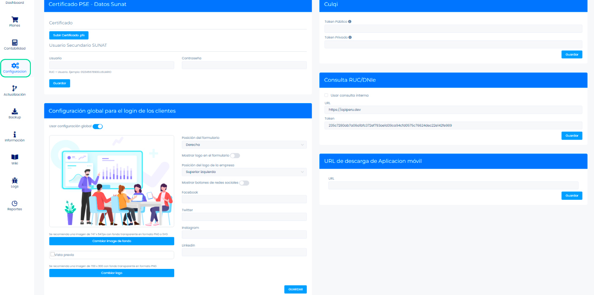
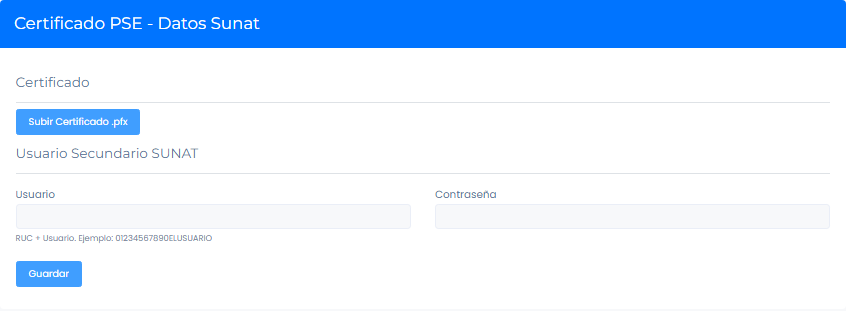
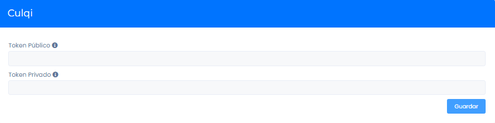
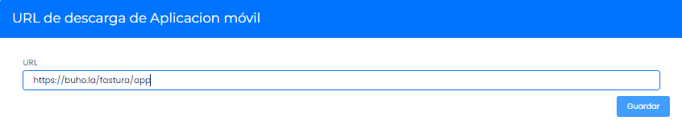
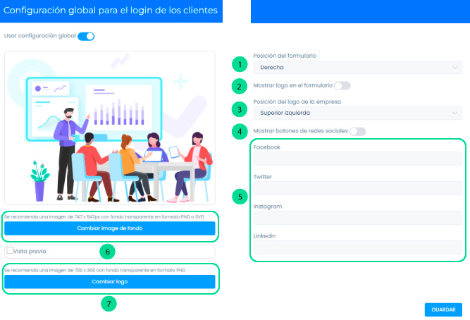

# Configuración

Puedes realizar las siguiente configuraciones dentro del sistema de facturación:

Iniciamos entrando a nuestro sistema **Administrador** donde visualizaremos el módulo de **Configuración**:

## Certificado PSE-datos SUNAT

Si usted posee algún convenio con una **PSE**, para poder brindarle servicio a sus clientes, debe subir el certificado, usuario y contraseña; todos estos datos les brindará la **PSE**.

## Culqi

Para integrar Culqi, es necesario colocar su usuario y contraseña para que los clientes hagan los pagos respectivos con tarjeta de crédito.

:::info NOTA:
 Debe tener una cuenta de Culqi Activa. Puede crear una cuenta aquí: **[culqi.com](https://culqi.com/)**.

:::

## Consulta RUC/DNIe

Al ser un cliente nuestro, esta sección ya está configurada y no necesita realizar ninguna acción. Usted puede hacer las consultas de manera gratuita.

## URL de descarga de Aplicación móvil

El cliente final tiene la opción de usar la aplicación móvil que por el momento solo está disponible para la versión de Android; es un archivo APK, que se descarga y se instala en el teléfono.

Descárgala con este enlace: **[https://buho.la/fastura.apk](https://buho.la/fastura.apk)**

:::info IMPORTANTE

Esta opción le da la ventaja de poder poner cualquier URL, para que su cliente solo haga click y pueda descargarlo.

:::

## Configuración global

En esta sección,se configura el login del cliente.

1. **Posición del formulario:** Puede ubicarlo hacia la izquierda o derecha.
2. **Tiene la opción de habilitar o deshabilitar el logo en el formulario**.
3. **Posición del logo de la empresa:** Puede elegir en qué parte estará ubicado.
4. **Tiene la opción de habilitar o deshabilitar los botones de las redes sociales**.
5. **En este campo puede ingresar el link de redes sociales**.
6. **Tiene la opción de cambiar la imagen de fondo:** Esta imagen aparece en el inicio de sesión de todos sus clientes.
7. **Botón Cambiar logo:** Tiene la opción de cambiar el logo por defecto que aparece en el inicio de sesión de todos sus clientes.

Finalmente presione en el botón **GUARDAR**.
