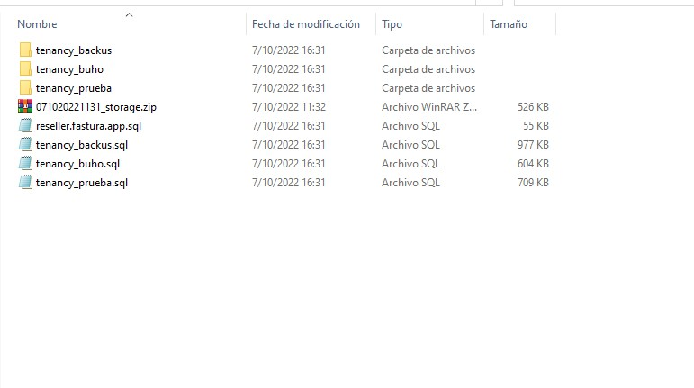

# Backups

Generar copias de seguridad de manera periódica es importante ya que contar con el respaldo de los datos de nuestros clientes, para generarlos es necesario:

Iniciar entrando a nuestro sistema **Administrador**, donde visualizaremos el módulo de **Backup**.

 En la parte lateral se observa las opciones para conectar por **FTP**.

## Generar un backup

Para generar un **Backup**, o copia de todos los archivos.

## Tipos

Debemos seleccionar los siguientes tipos:

1. **Todos:** esta opción descarga en un solo archivo comprimido (.zip) todos los comprobantes, pdf, archivos y base de datos de todas las cuentas que actualmente tengamos en el sistema.
2. **Individual:** esta opción descarga un archivo comprimido (.zip) con todos los comprobantes, pdf, archivos y base de datos de una empresa en específico.

:::danger NOTA

En las copias backup NO contienen logos ni imágenes de los productos.

:::

## Descomprimir

Seleccione el botón **iniciar proceso**, después aparecerá el Backup generado y podrá descargarlo.

Finalmente podrá descargar y descomprimir el archivo .zip para visualizar sus documentos.

:::danger IMPORTANTE

Recomendamos que realicen su copias de manera periódica por seguridad.

:::
