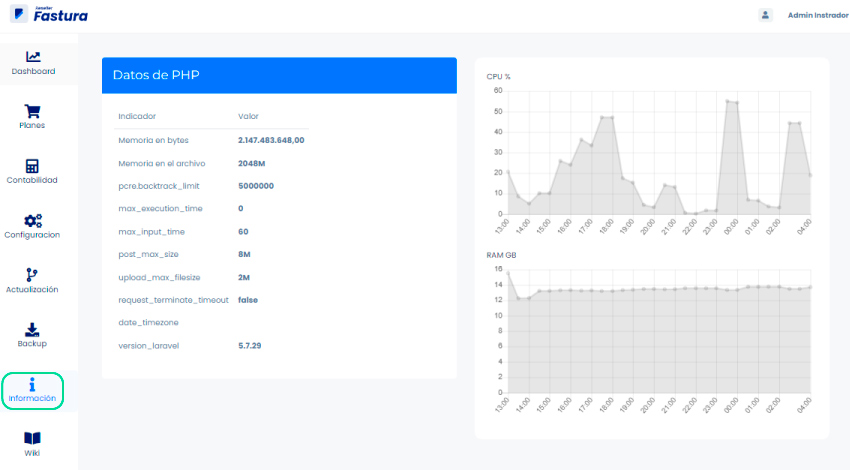

# Información

Si deseas conocer el consumo de recursos con el sistema de facturación, puedes consultar esta área:

Iniciamos entrando a nuestro sistema **Administrador** donde visualizaremos el **módulo de Información**.

En la sección datos de PHP se observa los datos de consumo y su representación gráfica.

