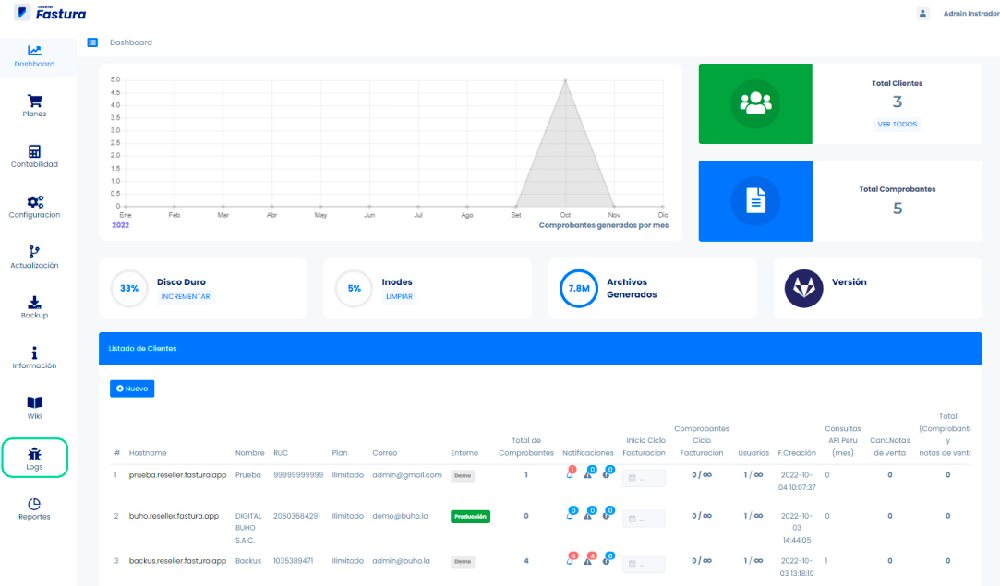
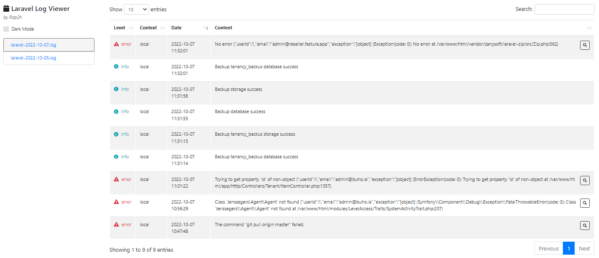

# Logs

El área de logs es de suma importancia ya que agrupa los errores generados en el sistema de facturación con este historial podremos detectar con mayor rapidez la solución para apoyar a nuestros clientes.
Podrás ubicarlo siguiendo estos pasos:

Iniciamos entrando a nuestro sistema **Administrador** donde visualizaremos el **módulo de Logs**.

## Vista del Log

Posteriormente, se mostrará un historial con fecha y hora, que nos permitirá detectar si se ha producido un error dentro de nuestra plataforma ,para notificar al soporte.

