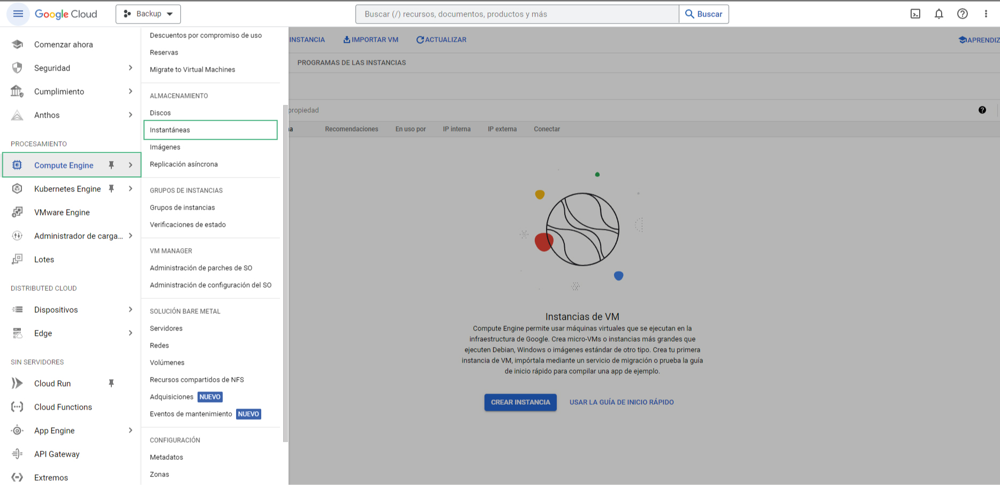
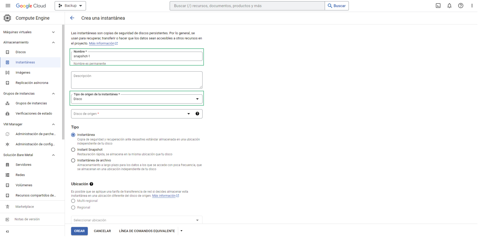
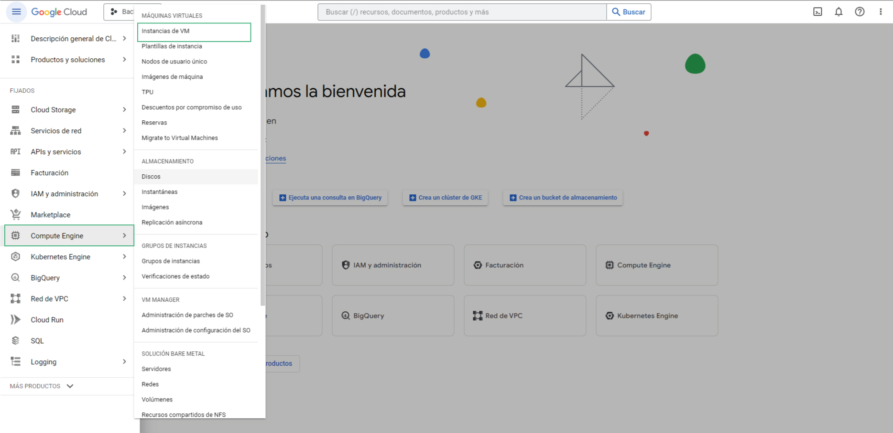
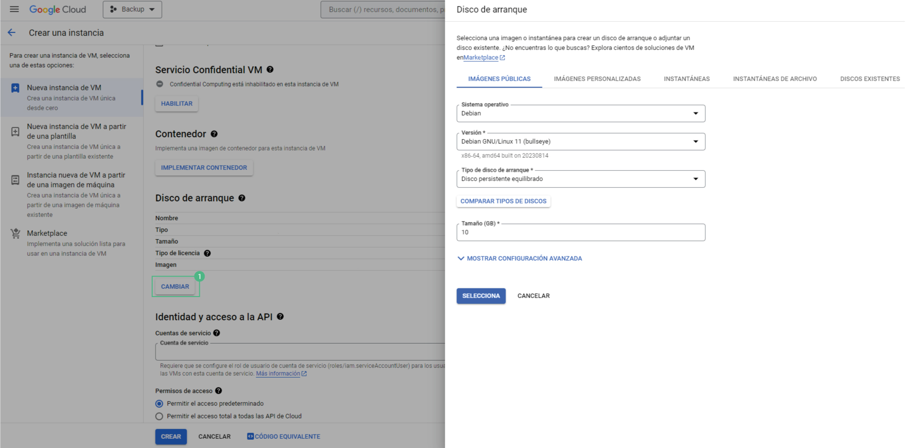
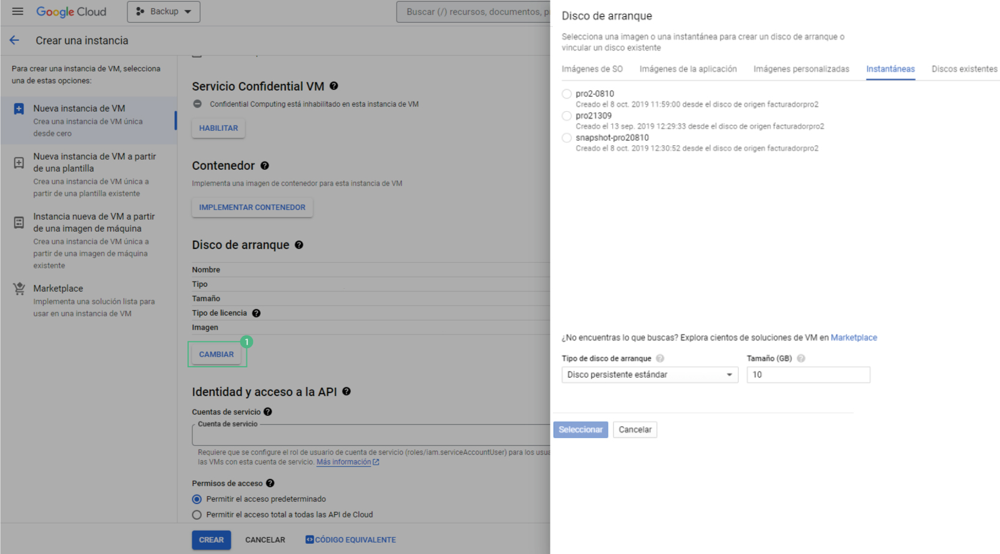

# Incrementar espacio en disco

Esta guía describe dos modos diferentes para aumentar el espacio en disco en Google Cloud, dependiendo de tu preferencia y necesidades. A continuación, te resumiré ambos modos:


## Modo 1: Ampliación del disco en la instancia existente

1. **Inicia sesión en la Consola de Google Cloud:** Abre tu navegador y accede a **[https://console.cloud.google.com](https://console.cloud.google.com)**

2. **Accede a Compute Engine y Discos:**  En el panel de navegación izquierdo, selecciona **"Compute Engine"** y luego **"Discos"**
    

3. **Crea una instantánea de seguridad:** Busca el disco de tu instancia en la lista de discos y selecciona su nombre. En la página de detalles del disco, haz clic en **"Crear instantánea"** para crear una copia de seguridad de tus datos actuales. Esto es importante para la seguridad.

    

4. **Modifica el tamaño del disco:** Aún en la página de detalles del disco, haz clic en "Editar". Modifica el tamaño del disco según tus necesidades y luego haz clic en "Guardar". No te preocupes, este proceso no afectará tus datos ni requerirá detener la instancia.

5. **Accede a tu instancia por SSH:** Utiliza tu cliente SSH preferido o la consola de Google Cloud para conectarte a tu instancia como superusuario. Si tu instancia utiliza una cuenta diferente, asegúrate de tener los permisos adecuados.

    

6. **Instala la herramienta cloud-guest-utils:** Ejecuta el siguiente comando para instalar la herramienta necesaria:
 ```bash
 sudo apt
 ```

  Y seguido: 

 ```bash
 apt -y install cloud-guest-utils
 ```

7. **Verifica la partición existente:** Para saber cuál es la partición que necesitas redimensionar, ejecuta:
 ```bash
 df -h
 ```

8. **Amplía la partición:** Utiliza el comando growpart para redimensionar la partición. Asegúrate de reemplazar **[DEVICE_ID]** con la ID de tu dispositivo y **[PARTITION_NUMBER]** con el número de partición correspondiente. Por ejemplo: 
 ```bash
 sudo growpart /dev/sda 1 
 ```

9. **Amplía el sistema de archivos:** Utiliza el comando resize2fs para redimensionar el sistema de archivos en la partición:
 ```bash
 sudo resize2fs /dev/sda1
 ```

10. **Verifica el nuevo espacio en disco:** Ejecuta
 ```bash
 df -h 
 ```

Nuevamente para asegurarte de que la partición se haya redimensionado correctamente y que dispones del espacio adicional.

## Modo 2: Creación de una nueva instancia con un disco más grande

1. **Inicia sesión en la Consola de Google Cloud:** Accede a **[https://console.cloud.google.com](https://console.cloud.google.com)** utilizando tu navegador.

2. **Accede a Compute Engine y Instantáneas:** En el panel de navegación izquierdo, selecciona **"Compute Engine"** y luego **"Instantáneas"**.
    

3. **Crea una instantánea de seguridad:** Haz clic en **"Crear instantánea"** y asigna un nombre a la instantánea. Selecciona el disco de origen de tu VM actual. 

    

4. **Crea una nueva instancia:** Selecciona **"Compute Engine"** y seguido **"Instancias de VM"**.

    

 Luego, crea una nueva instancia con los recursos (CPU, memoria) que necesitas.

 

5. **Configura el disco de arranque:** En la sección **"Disco de arranque"**. 

    

 Asigna el tamaño necesario al disco de la nueva VM.

 

6. **Selecciona la instantánea:** En la pestaña **"Instantáneas"**, elige la instantánea que creaste previamente como disco de inicio. 

    

7. **Configura las opciones de red:** Habilita el tráfico necesario, como HTTP u otros, según tus requisitos.

8. **Crea la nueva VM:** Haz clic en el botón **"Crear"** y espera a que la nueva instancia se inicie.

9. **Actualiza la IP (si es necesario):** Si la IP de tu nueva VM cambió, actualiza la configuración de tu proveedor de dominio (registro tipo A) para que apunte a la nueva IP.

10. **Accede por SSH a la nueva VM:** Utiliza tu cliente SSH preferido o la consola de Google Cloud para conectarte a la nueva VM.

11. **Verifica el espacio en disco:** Ejecuta
 ```bash
 df -h 
 ```
 Para asegurarte de que el espacio total del disco se ha incrementado.

12. **Amplía el sistema de archivos (si es necesario):** Si no ves todo el espacio asignado, sigue los pasos para instalar "cloud-guest-utils" y redimensionar la partición y el sistema de archivos, como se describió en el Modo 1.

13. **Verifica nuevamente el espacio en disco:** Ejecuta
 ```bash
 df -h 
 ```

 Para confirmar que se ha ampliado correctamente

14. **Detén la instancia original (si es necesario):** Si ya no necesitas la instancia original con espacio insuficiente, puedes detenerla desde la Consola de Google Cloud.

Asegúrate de seguir estas instrucciones cuidadosamente y de realizar copias de seguridad de tus datos críticos antes de realizar cambios significativos en tus instancias de Google Cloud.