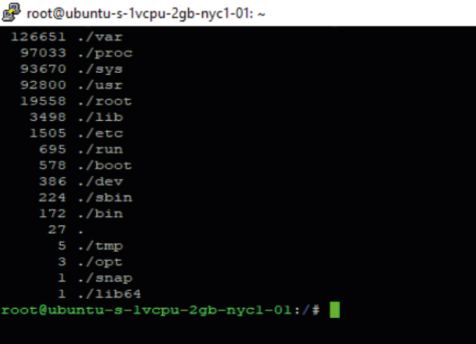

# Limpiar inodes 

En un sistema de archivos GNU/Linux, un inodo es una estructura de datos que almacena información sobre un archivo o directorio, como los permisos, el propietario, la ubicación en el disco, etc. Cuando los inodos están llenos, puedes experimentar problemas de falta de espacio en disco, incluso si aún queda espacio disponible en términos de capacidad de almacenamiento.

Pasos para realizar una limpieza manual de inodos:

1. **Realizar un backup de datos (opcional pero recomendado):** Antes de comenzar, es una buena práctica realizar una copia de seguridad de tus datos. En servicios como Google Cloud o AWS, puedes crear un snapshot o instantánea de tu instancia.

2. **Verificar el espacio en disco:** Para verificar el espacio en disco, utiliza el siguiente comando:
 ```bash
 df -h
 ```

 

 Para verificar la utilización de inodos:
 
 ```bash
 df -i
 ```

 
 
3. **Limpieza manual de inodos:** Si los inodos están al 100% de capacidad, sigue estos pasos para limpiarlos:
   * **Realiza un backup de tus datos:** Si estás en Google Cloud o AWS, puedes crear un snapshot o instantánea como respaldo.

   * **Accede a la raíz de tu servidor:** Ejecuta el siguiente comando para navegar a la raíz:

     ```bash
     cd/
     ```
   * **Contar la utilización de inodos:** Utiliza este comando para identificar el directorio que tiene el valor más alto de inodos:

     ```bash
     find . -printf "%h\n" | cut -d/ -f-2 | sort | uniq -c | sort -rn
     ```

     El directorio con el valor más alto es el que contiene la mayor cantidad de inodos.
     
   * **Accede al directorio con inodos altos:** Por ejemplo, si /var tiene un valor alto, accede a ese directorio y ejecuta nuevamente el comando del paso anterior.
      

   * **Identifica subdirectorios con alto uso de inodos:** Continúa accediendo a directorios más profundos y ejecuta el mismo comando del paso anterior hasta identificar los subdirectorios problemáticos.
      
  
   * **Detén los contenedores y el proxy de Docker:** Si utilizas Docker, detén todos los contenedores y el proxy con los siguientes comandos:

      * Para los contenedores en tu proyecto:

        ```bash
        cd /ruta/del/proyecto
        docker-compose down
        ```

      * Si no puedes detener los servicios, usa:

        ```bash
        docker stop $(docker ps -a -q)
        ```

      * Para el proxy (si aplicable):

        ```bash
        cd /root/proxy
        docker-compose down
        ```
4. **Reinicia Docker:** Ejecuta el siguiente comando para reiniciar Docker:

    ```bash
    service docker restart
    ```

5. **Limpieza automática de Docker:** Ejecuta el siguiente comando para realizar una limpieza de Docker:

    ```bash
    docker system prune
    ```
    * Confirma la acción escribiendo "Y". Este proceso puede llevar tiempo.
 
6. **Verifica el espacio de inodos nuevamente:** Ejecuta

    ```bash
    df -i
    ```
    Para asegurarte de que el valor de la columna IUse % haya disminuido.

7. **Inicia nuevamente los contenedores y el proxy:** Si todo está en orden, inicia los contenedores y el proxy nuevamente.

    + Para el proxy:
      ```bash
      cd /root/proxy
      docker-compose up -d
      ```

    + Para los contenedores en tu proyecto:
      ```bash
      cd /ruta/del/proyecto
      docker-compose up -d
      ```

* Verifica el estado de los contenedores: Ejecuta docker ps para asegurarte de que los contenedores estén en funcionamiento y verifica que tu proyecto funcione correctamente.

## Limpieza automática de inodos (script Bash)

Si deseas automatizar este proceso, puedes seguir estos pasos:

1. Accede como superusuario:

    ```bash
    sudo su
    ```

2. Utiliza ```nano``` u otro editor de texto para crear y pegar el siguiente script:

    ```bash
    nano docker-prune.sh
    ```

    Pega el contenido del **script**.

3. Edita la ruta de tu proyecto en la línea 38 o cerca:

    ```bash
    cd $HOME/[nombre_del_proyecto]
    ```
    Asegúrate de especificar la ruta correcta de tu proyecto.

4. Guarda el archivo presionando Ctrl + X, confirma que deseas guardar y cierra el editor.

5. Asigna permisos ejecutables al archivo:
    ```bash
    chmod +x docker-prune.sh
    ```
  
6. Ejecuta el script:
    ```bash
    ./docker-prune.sh
    ```

Este script automatizará el proceso de limpieza de inodos, lo que facilitará la administración del espacio en disco en el futuro.