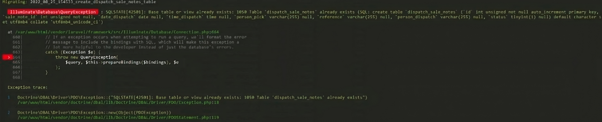

# Error al ejecutar migraciones

Para este tipo de errores lo que hay que reaslizar es primero ingresar al archivo que esta generando el error, para ello se tiene qee ingresar una condicional.



Este error se soluciona facilmente colocando un condicional dentro del archivo de migraciones que generó un error.

En la imagen de arriba se muestra un error en el archivo de migración llamado **create_dispatch_sale_notes_table** entonces tenemos que dirigirnos a ese archivo y colocar esto (lo que se muestra es un ejemplo): 

```php title="migrations/2022-05-24-create_dispatch_sale_notes_table.php"
<?php 
class CreateDispatchSaleNotesTable extends Migration {
    public function up()
    {
        //! Se tiene que ingresar esta condicional para poder resolver el problema
        if(!Schema::hasTable('dispatch_sale_notse')) {
            /**
             * 
             * 
             * 
             * 
             */
        }
    }
}
?>
```

Luego de arregar esa condicional, solo debería ejecutar de nuevo las migraciones para que se ejecute con normalidad.