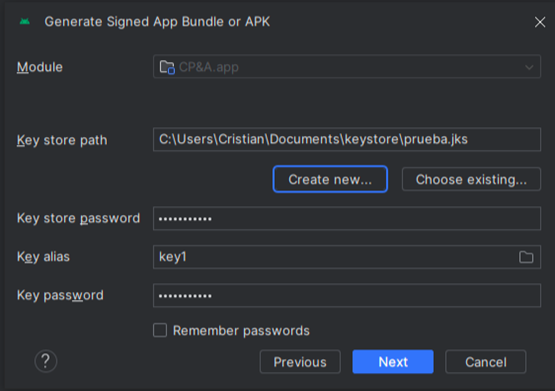
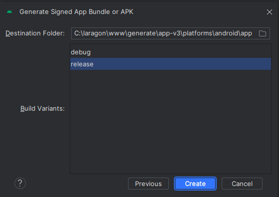
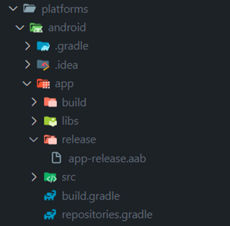

# Proceso de creación de AAB y publicación

## 1. Compilación

Dentro de Android Studio:
1. Seleccionar la opción de `Build`
2. Hacer clic en `Generate Signed Bundle / APK`
3. Elegir `Android App Bundle`

### ⚠️ Precauciones importantes:
1. Tener cuidado con el nombre de paquete. Para Google, un cambio en el nombre del paquete puede identificar la app como una aplicación completamente distinta, lo que impediría futuras actualizaciones.
2. Guardar el key store creado en el primer compilado o enviarlo al cliente. Si se pierde este archivo con los datos, no se podrá actualizar la app publicada.


---


---

### Proceso de firma del AAB

Al hacer clic en `Next`, se abrirá un recuadro para firmar el AAB. Debajo de `key store path` hay un botón `Create New` que mostrará el siguiente formulario:


#### Campos requeridos:
- **Key store path y password**: Ruta donde se almacenará el key store con su contraseña
- **Alias**: Un alias personalizado
- **Password**: Contraseña para el alias
- **Certificate**: No es necesario completar todos los campos, pero mínimo uno debe estar completado

> ⚠️ **IMPORTANTE**: Tener mucho cuidado con la ubicación del key store y las respectivas claves. Si la app ya está publicada en Play Store y se pierde el key store o la clave es incorrecta, no se podrá actualizar la aplicación.



---



Una vez creado, puedes verificar el proyecto en la carpeta `platforms\android` de tu editor de código.



## 2. Subir Aplicación

1. Ir a la opción "Todas las Aplicaciones"
2. Presionar el botón "Crear Aplicación"


### Configuración requerida:
- Datos generales de la aplicación
- Aceptar las declaraciones de Google
- Información sobre la App
- Categoría
- Países
- Regulaciones financieras
- Publicidad
- Ruta hacia la Política de Privacidad

### 3. Revisión de Ficha

#### Descripción corta:
```
Aplicación de facturación electrónica simple para clientes de nuestra plataforma
```

#### Descripción larga:
```
Una aplicación de facturación electrónica que te ayudará a tu empresa a despegar 

Contamos con las siguientes características:
- Venta POS
- Comprobante en facturación y boleta
- G.R. Remitente y G.R. Transportista 
- Inventario para productos
- Comprobantes para tickets
```

#### Requisitos de imágenes:
- 4 imágenes de la aplicación
- Icono de 510 x 510px
- Imagen promocional de la app

### Requerimientos adicionales:
1. Link de la Política y Privacidad de la empresa
2. Link de la URL de la demo con accesos para testers de Google
3. Icono con dimensiones: 512 x 512 px
4. Gráfico de funciones: Imagen de la marca del cliente (1024x500px)
