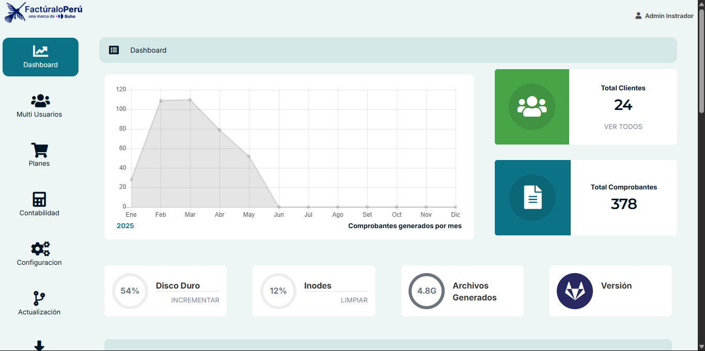
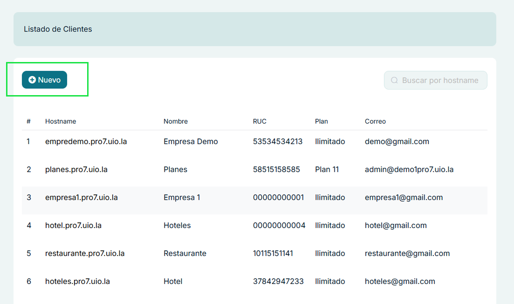
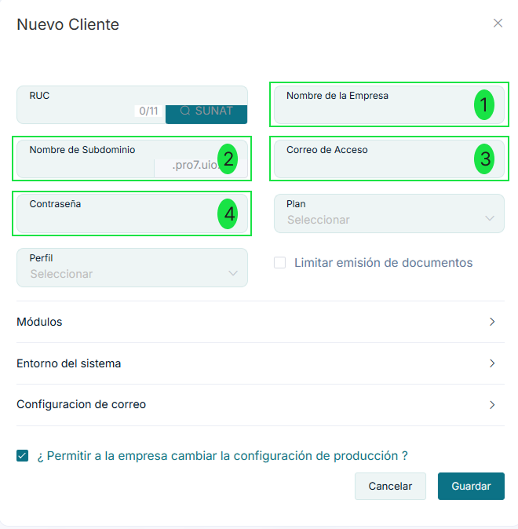
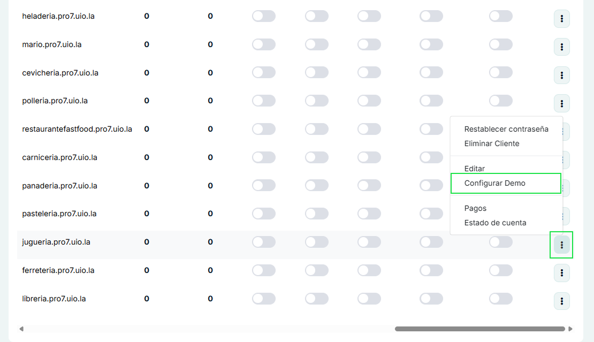
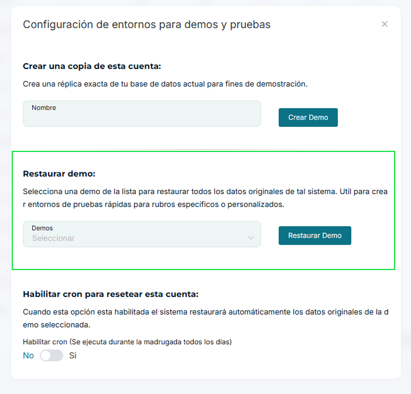

# Instalación de Empresas Demo

:::info Información
Esta guía te ayudará a configurar las empresas demo preinstaladas en tu servidor Pro7. Las demos incluyen datos preestablecidos como productos, imágenes y configuraciones específicas para cada tipo de negocio.
:::

## Requisitos Previos

- Acceso al panel de administrador
- Permisos de administrador
- Empresas demo preinstaladas en el servidor

## Proceso de Configuración

### 1. Acceso al Panel de Administrador

1. Inicia sesión en el panel de administrador con tus credenciales
2. Navega a la sección de clientes/empresas

### 2. Creación de Nueva Empresa Demo

1. En el listado de clientes, localiza el botón **Nuevo** en la esquina superior izquierda

2. Al hacer clic en **Nuevo**, se abrirá el formulario de creación de empresa. Completa los datos obligatorios según la siguiente tabla:

:::danger Importante
Recuerda que los nombres de subdominio que aparecen en la tabla son obligatorios y deben ser ingresados exactamente como se muestran. Solo debes colocar el nombre del subdominio, por ejemplo: `ferreteria`. El sistema agregará automáticamente el resto del dominio según la configuración de tu servidor. Esto es fundamental para que la demo funcione correctamente y puedas acceder sin inconvenientes.
:::

| Empresa | Subdominio | Correo | Contraseña |
|---------|------------|---------|------------|
| Librería | libreria | libreria@gmail.com | 123456 |
| Ferretería | ferreteria | ferreteria@gmail.com | 123456 |
| Juguería | jugueria | jugueria@gmail.com | 123456 |
| Tienda de Abarrotes | tiendadeabarrotes | tienda_de_abarrotes@gmail.com | 123456 |
| Pastelería | pasteleria | pasteleria@gmail.com | 123456 |
| Panadería | panaderia | panaderia@gmail.com | 123456 |
| Fuente de Soda | fuentedesoda | fuente_de_soda@gmail.com | 123456 |
| Carnicería | carniceria | carniceria@gmail.com | 123456 |
| Restaurante Fast Food | restaurantefastfood | restaurante_fast_food@gmail.com | 123456 |
| Pollería | polleria | polleria@gmail.com | 123456 |
| Cevichería | cevicheria | cevicheria@gmail.com | 123456 |
| Heladería | heladeria | heladeria@gmail.com | 123456 |

:::info Más Información
Para más detalles sobre la creación de clientes, consulta la documentación completa en [Crear Cuenta](../../multi-empresa/administrador/02-Crear-cuenta.md)
:::

### 3. Configuración de la Demo

Una vez creada la empresa, sigue estos pasos para activar la demo:

1. En el listado de clientes, localiza la empresa demo creada
2. Haz clic en los tres puntos (⋮) al final de la fila
3. Selecciona la opción **Configurar Demo**

4. En la ventana de configuración:
   - Ubicara la opcion de **Restaurar Demo**
   - Seleccionara la demo correspondiente al tipo de negocio
   - El sistema cargará automáticamente:
     - Productos preestablecidos
     - Imágenes
     - Configuraciones específicas del negocio

:::tip Nota
Las demos incluyen datos de ejemplo que puedes modificar según tus necesidades. Se recomienda revisar y ajustar la configuración después de la instalación.
:::

## Verificación de la Instalación

Para verificar que la demo se ha instalado correctamente:

1. Accede a la URL de la empresa demo (ejemplo: `https://libreria.tudominio.com`)
2. Verifica que puedas iniciar sesión con las credenciales proporcionadas
3. Comprueba que los productos y configuraciones se hayan cargado correctamente

--- 

## Accesos de Verificación a Empresas Demo en tu Entorno

A continuación, se presenta una tabla con los accesos de las empresas demo originales que fueron instaladas en su servidor. Utiliza esta información para cotejar que, al activar y configurar las empresas demo desde el panel de administrador, los datos cargados coincidan correctamente con los valores originales.
Accede a la URL correspondiente, inicia sesión con las credenciales indicadas y verifica que los productos, configuraciones y datos preestablecidos se hayan cargado según lo esperado.

| Empresa                | URL de Acceso                                      | Correo                        | Contraseña |
|------------------------|----------------------------------------------------|-------------------------------|------------|
| Librería               | [https://libreria.pro7.uio.la/](https://libreria.pro7.uio.la/)                   | libreria@gmail.com            | 123456     |
| Ferretería             | [https://ferreteria.pro7.uio.la/](https://ferreteria.pro7.uio.la/)                 | ferreteria@gmail.com          | 123456     |
| Juguería               | [https://jugueria.pro7.uio.la/](https://jugueria.pro7.uio.la/)                     | jugueria@gmail.com            | 123456     |
| Tienda de Abarrotes    | [https://tiendadeabarrotes.pro7.uio.la/](https://tiendadeabarrotes.pro7.uio.la/)   | tienda_de_abarrotes@gmail.com | 123456     |
| Pastelería             | [https://pasteleria.pro7.uio.la/](https://pasteleria.pro7.uio.la/)                 | pasteleria@gmail.com          | 123456     |
| Panadería              | [https://panaderia.pro7.uio.la/](https://panaderia.pro7.uio.la/)                   | panaderia@gmail.com           | 123456     |
| Fuente de Soda         | [https://fuentedesoda.pro7.uio.la/](https://fuentedesoda.pro7.uio.la/)             | fuente_de_soda@gmail.com      | 123456     |
| Carnicería             | [https://carniceria.pro7.uio.la/](https://carniceria.pro7.uio.la/)                 | carniceria@gmail.com          | 123456     |
| Restaurante Fast Food  | [https://restaurantefastfood.pro7.uio.la/](https://restaurantefastfood.pro7.uio.la/)| restaurante_fast_food@gmail.com| 123456    |
| Pollería               | [https://polleria.pro7.uio.la/](https://polleria.pro7.uio.la/)                     | polleria@gmail.com            | 123456     |
| Cevichería             | [https://cevicheria.pro7.uio.la/](https://cevicheria.pro7.uio.la/)                 | cevicheria@gmail.com          | 123456     |
| Heladería              | [https://heladeria.pro7.uio.la/](https://heladeria.pro7.uio.la/)                   | heladeria@gmail.com           | 123456     |

> **Nota:** Si encuentras algún inconveniente al acceder o los datos no coinciden, revisa la configuración de la demo correspondiente o repite el proceso de restauración.

