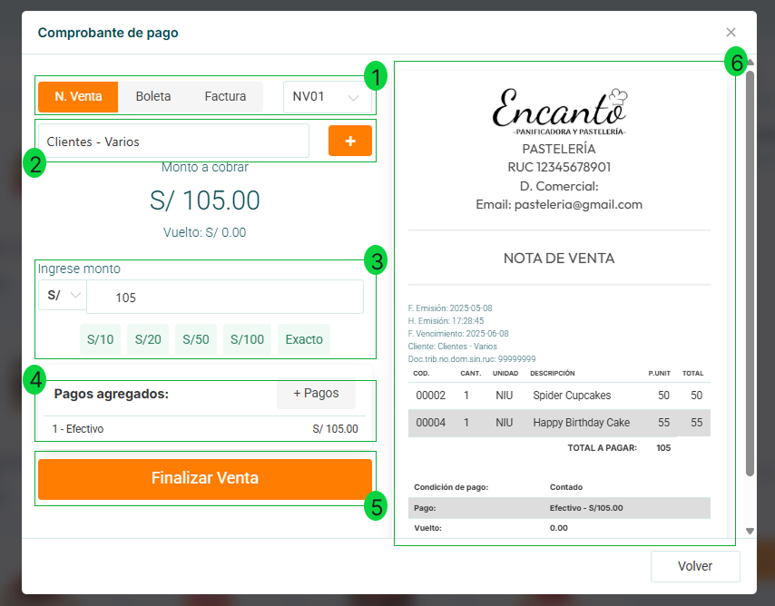
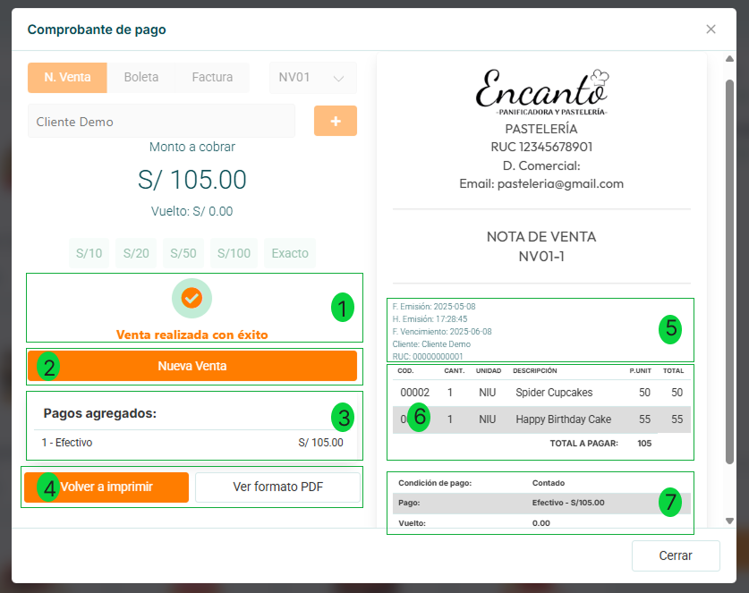

# Flujo de Venta

El sistema VendeYa.pe está optimizado para realizar ventas de manera rápida y eficiente. A continuación, se detalla el proceso paso a paso con las instrucciones específicas para cada etapa del flujo de venta.

## Proceso de Selección de Productos

**1. Carrito de compras:** Panel lateral donde se visualizan los productos seleccionados con sus nombres, cantidades, precios unitarios y totales por producto.

**2. Total productos:** Muestra la cantidad total de productos diferentes en el carrito (2.00).

**3. Total a pagar:** Calcula automáticamente la suma total de todos los productos seleccionados (S/ 105.00).

**4. Botón Finalizar Venta:** Al hacer clic, se procede a la pantalla de pago y emisión de comprobante.

## Proceso de Pago

**1. Tipo de comprobante:** Permite seleccionar entre Nota de Venta, Boleta o Factura, y el número de serie (NV01).

**2. Selección de cliente:** Permite elegir un cliente existente o agregar uno nuevo mediante el botón "+".

**3. Campo de ingreso de monto:** Permite ingresar manualmente el monto recibido del cliente.

**4. Sección de pagos agregados:** Muestra el detalle de los pagos ingresados, en este caso "1 - Efectivo" por S/ 105.00.

**5. Botón de Finalizar Venta:** Al hacer clic, se procesa el pago y se genera el comprobante.

**6. Información del negocio:** Muestra el logo, nombre y datos fiscales del negocio (Pastelería Encanto).

## Emisión de Comprobante

**1. Mensaje de confirmación:** Indica "Venta realizada con éxito" como mensaje de verificación.

**2. Botón Nueva Venta:** Permite iniciar inmediatamente una nueva transacción.

**3. Pagos agregados:** Muestra el resumen del pago realizado (efectivo).

**4. Botones de gestión de comprobante:** 
   - **Volver a imprimir:** Permite reimprimir el comprobante.
   - **Ver formato PDF:** Permite visualizar o guardar el documento en PDF.

**5. Datos del comprobante:** Muestra la información completa del comprobante emitido:
   - **Tipo de documento:** NOTA DE VENTA
   - **Número de comprobante:** NV01-1
   - **Fecha de emisión:** Muestra la fecha y hora exacta de la venta
   - **Fecha de vencimiento:** Indica hasta cuándo es válido el comprobante
   - **Datos del cliente:** Nombre (Cliente Demo) y RUC/DNI (0000000001)

**6. Detalle de venta:** Muestra la lista completa de productos vendidos con:
   - **Código:** Identificador único del producto (00002, 00004)
   - **Cantidad:** Número de unidades vendidas (1)
   - **Unidad:** Tipo de unidad (NIU)  
   - **Descripción:** Nombre del producto (Spider Cupcakes, Happy Birthday Cake)
   - **P.UNIT:** Precio unitario por producto (50, 55)
   - **TOTAL:** Importe total por producto (50, 55)
   - **Total a pagar:** Muestra el importe final de la venta (105).

**7. Detalles de la transacción:** Muestra la información completa del pago:
   - **Condición:** Especifica que la venta fue al contado
   - **Método:** Indica el tipo de pago utilizado (Efectivo - S/105.00)  
   - **Vuelto:** Muestra el cambio a devolver al cliente (0.00 en este caso)

## Recomendaciones para un Flujo de Venta Óptimo

1. **Preparación previa:**
   - Asegúrese de que todos los productos estén correctamente registrados en el catálogo.
   - Configure previamente las categorías para facilitar la búsqueda de productos.

2. **Durante la venta:**
   - Utilice la barra de búsqueda para localizar rápidamente productos específicos.
   - Aproveche los botones de acceso rápido para agilizar el ingreso de pagos.
   - Para clientes frecuentes, mantenga actualizada la base de datos para seleccionarlos fácilmente.

3. **Cierre de venta:**
   - Verifique que el tipo de comprobante seleccionado sea el correcto según las necesidades del cliente.
   - Confirme el monto recibido antes de finalizar la venta.
   - Utilice la función "Nueva Venta" para continuar inmediatamente con el siguiente cliente.

4. **Cierre de caja:**
   - Al finalizar el día, utilice la función "Cerrar caja y enviar a la nube" desde el menú de configuración.
   - Esto asegurará que todas las ventas realizadas se sincronicen correctamente con el Sistema de Facturación Pro 7 y Pro X.

:::danger IMPORTANTE:
Recuerde que VendeYa.pe no valida stock automáticamente. Es responsabilidad del negocio asegurarse de tener disponibilidad de los productos ofrecidos en el catálogo.
:::