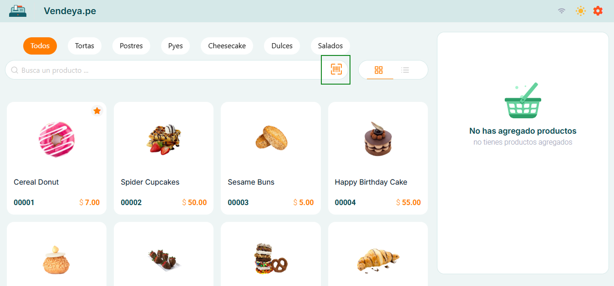
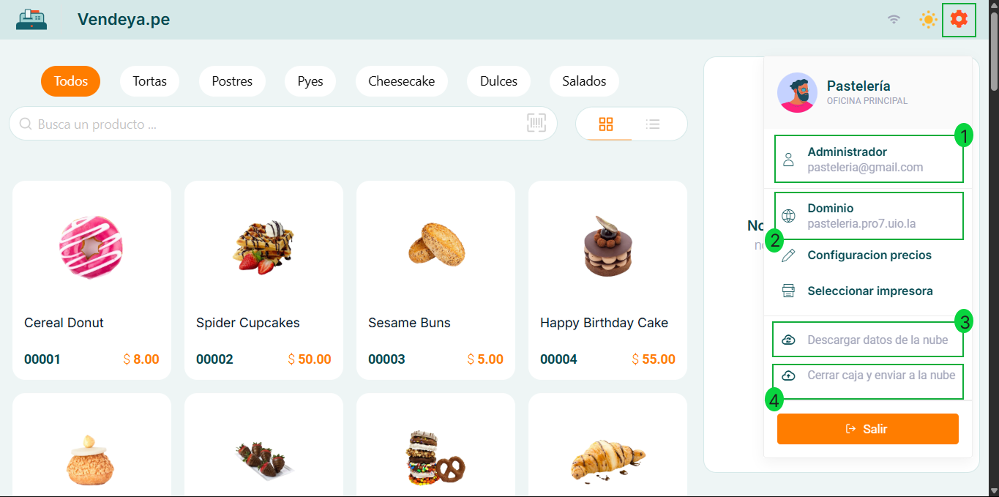
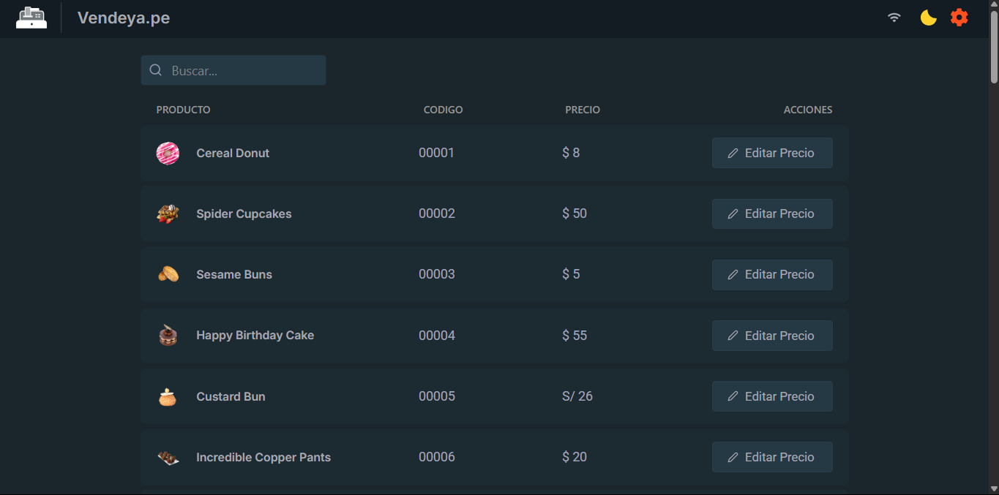
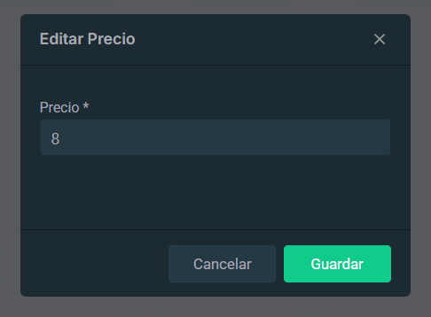

# Navegación por la Interfaz

La interfaz de VendeYa.pe está diseñada para ser intuitiva y fácil de usar, especialmente en entornos de venta rápida. A continuación, se describen los principales elementos de la interfaz:

### Pantalla Principal de Productos

1. **Filtros de Categorías**: Permite filtrar los productos por categorías como Todos, Tortas, Postres, Pyes, Cheesecake, Dulces, Salados, etc.
2. **Vistas de Productos**: Permite cambiar entre vista de cuadrícula o lista para visualizar los productos.
3. **Configuración**: Acceso a las opciones de configuración del sistema.
4. **Catálogo de Productos**: Muestra los productos disponibles con imágenes, nombres, códigos y precios.

:::danger Productos sin código interno
Solo los productos que tengan un código interno asignado en el Sistema de Facturación serán visibles en VendeYa.pe. Asegúrese de que todos los productos que desea mostrar tengan un código interno configurado.
:::

### Búsqueda por Código de Barras

Al activar esta opción se listarán todos los productos que cuenten con un código de barras previamente registrado en el sistema. 

### Favoritos  

Puedes marcar productos como favoritos para destacarlos y tenerlos siempre visibles en la parte superior del listado de productos.

Para hacerlo, selecciona el icono de estrella ⭐ en la parte superior derecha de cada producto.

Una vez marcados, estos productos se mostrarán primero en el listado, facilitando su acceso en ventas rápidas o productos de alta demanda.

:::note
Los favoritos se pueden activar y desactivar en cualquier momento tocando nuevamente el ícono de estrella.
:::

### Listado de Precios

Al seleccionar esta opción se mostrará una vista detallada que incluye:

- Lista completa de productos disponibles
- Código interno de cada producto
- Precios actuales configurados

Esta vista es especialmente útil para revisar y gestionar el catálogo completo de productos y sus precios de manera eficiente.

---

:::note
La pantalla principal también cuenta con una barra de búsqueda que permite encontrar productos rápidamente por nombre o código.
:::

### Menú de Configuración

Desde el menú de configuración, los usuarios pueden acceder a diversas opciones:

1. **Información de Usuario**: Muestra el perfil del administrador y el correo electrónico asociado.
2. **Dominio**: Indica el dominio asignado al negocio, en este caso el asociado a su Sistema de Facturacion.
3. **Descargar datos de la nube**: Permite sincronizar la información local con los datos almacenados en la nube, la plataforma toma los datos del Facturador, si ha ingresado nuevos productos debera descargar los datos con esta opcion.
4. **Cerrar caja y enviar a la nube**: Funcionalidad para finalizar operaciones diarias y enviar la información a la nube.

El sistema también ofrece opciones para seleccionar impresora y configurar precios de los productos.

### Tema Oscuro

VendeYa.pe incluye un modo oscuro que reduce la fatiga visual en ambientes con poca luz. La funcionalidad es idéntica a la versión clara, pero con un esquema de colores diferente.

### Configuración de Precios

:::danger Acceso Restringido
La configuración de precios está disponible únicamente para usuarios con permisos de administrador. Los usuarios con roles estándar no podrán acceder a esta funcionalidad.
:::

La pantalla de configuración de precios permite al administrador:

- Ver todos los productos en formato de lista con sus códigos y precios actuales
- Editar rápidamente los precios de cada producto

- Buscar productos específicos mediante la barra de búsqueda
- Visualizar las imágenes de los productos para una fácil identificación

Esta funcionalidad es especialmente útil para actualizar precios rápidamente sin necesidad de modificar toda la información del producto.

## Limitaciones del Sistema

Es importante tener en cuenta las siguientes limitaciones al utilizar VendeYa.pe:

- **No valida stock automáticamente**: El negocio debe asegurarse de tener disponibilidad de los productos ofrecidos en el catálogo.
- **Orientado a flujo de caja rápido**: No está diseñado para negocios que requieren procesos de venta complejos o personalizados.
- **Catálogo predefinido**: Los productos deben estar previamente configurados en el sistema.
- **Sincronización manual**: Los datos deben enviarse manualmente a la nube al cerrar caja.

Para más información o soporte técnico, contacte a nuestro equipo a través de la página web oficial.